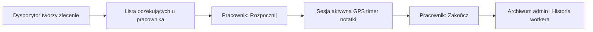

# Werkit — Instrukcja obsługi

Pełny podręcznik użytkownika systemu Werkit (logistyka floty i praca w terenie).

**Wersja w aplikacji:** ekrany `/worker/help`, `/admin/help`, `/platform/help`  
**Źródło treści:** `src/i18n/locales/helpContent.ts` (PL) — przy zmianach aktualizuj oba miejsca.

---

## Spis treści

1. [O systemie](#1-o-systemie)
2. [Logowanie i dostęp](#2-logowanie-i-dostęp)
3. [Część I — Pracownik terenowy](#3-część-i--pracownik-terenowy)
4. [Część II — Dyspozytor / administrator](#4-część-ii--dyspozytor--administrator)
5. [Część III — Podgląd (viewer)](#5-część-iii--podgląd-viewer)
6. [Część IV — Utrzymanie ruchu (DUR)](#6-część-iv--utrzymanie-ruchu-dur)
7. [Część V — Konsola platformy (superadmin)](#7-część-v--konsola-platformy-superadmin)
8. [Przepływ zlecenie → sesja → archiwum](#8-przepływ-zlecenie--sesja--archiwum)
9. [Załączniki](#9-załączniki)

---

## 1. O systemie

Werkit to system logistyczny dla floty i pracowników w terenie. Składa się z:

| Środowisko | Adres | Użytkownicy |
|------------|-------|-------------|
| Panel dyspozytora | `/admin` | Administratorzy, podgląd, liderzy z delegacją |
| Aplikacja pracownika | `/worker` | Operatorzy, kierowcy, serwisanci (PWA / APK Android) |
| Konsola platformy | `/platform` | Superadmin (multi-tenant) |

Moduły opcjonalne per organizacja (ustawiane przez superadmina):

- **GPS i mapa** — śledzenie trasy, mapa na żywo, geofencing, planowanie trasy, nawigacja
- **DUR (utrzymanie ruchu)** — magazyn części, typy zasobów, części na zleceniach napraw

---

## 2. Logowanie i dostęp

1. Otwórz adres aplikacji (web) lub uruchom APK na telefonie.
2. Zaloguj się loginem i hasłem przekazanym przez administratora.
3. Po logowaniu system przekieruje Cię:
   - **pracownik** → `/worker`
   - **administrator / podgląd** → `/admin`
   - **superadmin** → `/platform`
4. W nagłówku możesz zmienić **język** (PL / EN / DE) i **motyw** (jasny / ciemny).
5. Wersję aplikacji web i APK porównaj w **Ustawieniach Firmy** (`/admin/settings`).

Polityka prywatności (GPS, dane osobowe): `/privacy-policy`

---

## 3. Część I — Pracownik terenowy

Ekran pomocy: **Pomoc** w dolnym menu (`/worker/help`).

### Szybki kontakt

Numer telefonu firmy (z ustawień) — przycisk „Zadzwoń do dyspozytora".

### 1. Rozpoczynanie pracy

Gdy wejdziesz w zakładkę **Sesja**, zobaczysz listę zleceń przygotowanych przez dyspozytora.

Aby rozpocząć pracę, kliknij **„Rozpocznij to zlecenie"**. Od tego momentu aplikacja rejestruje czas pracy i (gdy wymagane) trasę GPS.

- **Kolor czerwony** — zlecenie przeterminowane; pierwszeństwo realizacji.
- **Kolor różowy** — zlecenie zbliżające się (np. najbliższe godziny).
- **Priorytety** — PILNE, WAŻNY, NORMALNY, NISKI.
- Anulowanie startu możliwe tylko w oknie czasowym ustawionym przez firmę.

### 2. Notatki i zdjęcia z trasy

Podczas sesji dostępne są przyciski dokumentacji:

- **Dodaj notatkę** — informacja z drogi, przypisana do lokalizacji GPS.
- **Zrób zdjęcie** — dokumentacja pracy (rozładunek, awaria, WZ).
- **Zgłoś dotarcie na miejsce** — checkpoint przyjazdu.

Niektóre zlecenia wymagają co najmniej jednego zdjęcia przed zakończeniem.

### 3. Śledzenie i GPS

GPS działa tylko podczas aktywnej sesji. Po **Zakończ** lokalizacja nie jest pobierana.

- **Szukam…** (żółty) — oczekiwanie na sygnał; unikaj podziemnych garaży.
- **Połączono** (zielony) — GPS OK.
- **Kategorie stacjonarne** — bez mapy i trasy; notatki i zdjęcia działają normalnie.

### 4. Zlecenia własne

Przy uprawnieniu **„własne zlecenia"** przycisk **„LUB ZDEFINIUJ WŁASNE"** pozwala wybrać klienta, zasób, materiał i od razu rozpocząć pracę.

### 5. Kreator własnego zlecenia

Kroki: kategoria → zasób → szczegóły → harmonogram → podsumowanie. Po zatwierdzeniu sesja startuje automatycznie.

### 6. Delegacja zleceń

Lider z delegacją przypisuje zlecenie innemu pracownikowi z ekranu Sesja (pracownik, kategoria, zasób, opis, termin).

### 7. Tryb offline i kolejka

Przy braku sieci operacje kolejkują się lokalnie i synchronizują po powrocie internetu. Baner pokazuje liczbę oczekujących operacji.

**Kolejka po sesji** — podgląd kolejnych zleceń od dyspozycji (bez akceptacji z tego widoku).

### 8. Alarmy i przypomnienia

- Zlecenie opóźnione / zbliżający się termin / przekroczenie szacowanego czasu.
- Snooze lub szybki start z powiadomienia.
- Ustawienia w **Profil**.

### 9. Nawigacja i edycja trasy

Mapa, dystans, planowana trasa (gdy moduł GPS włączony). Nawigacja turn-by-turn i edycja trasy — zależnie od flag platformy i uprawnień konta.

### 10. Historia pracy

Zakładka **Historia** — archiwum sesji: mapa, zdjęcia, notatki. Tylko odczyt.

### 11. Części zamienne (DUR)

Przy zleceniu naprawy i uprawnieniu serwisowego DUR: pobranie (WZ) i zwrot (PZ) części na sesji. Moduł musi być włączony dla organizacji.

### 12. Profil i powiadomienia

Dane konta, struktura org., powiadomienia, biometria (APK). Administratorzy mogą przejść do panelu `/admin`.

### Procedura awaryjna

Zatrzymaj pracę w bezpiecznym miejscu, zabezpiecz ładunek, zadzwoń do dyspozytora (przycisk w Pomocy). Jeśli możliwe — zdjęcie sytuacji w aplikacji.

---

## 4. Część II — Dyspozytor / administrator

Ekran pomocy: **Pomoc** w menu System (`/admin/help`).

Panel służy do planowania zleceń, zarządzania zasobami i podglądu pracy w terenie.

### 1. Wprowadzenie — role i dostęp

| Rola | Uprawnienia |
|------|-------------|
| Administrator | Pełna edycja |
| Podgląd (viewer) | Odczyt bez zapisu |
| Delegacja | Zlecenia, Raport, Ludzie + tworzenie zleceń |
| Pracownik | Aplikacja `/worker` |

### 2. Dyspozytornia (Zlecenia)

Gantt, lista zleceń i sesji, kategorie zleceń.

- Tworzenie/edycja zleceń: pracownik, kategoria, zasób, klient, materiał, priorytet, termin.
- Konflikty harmonogramu — ostrzeżenie przy nakładaniu terminów.
- Wymuszenie zakończenia sesji; archiwum z usuwaniem chronionym hasłem.
- Link `?open={id}` otwiera szczegóły zlecenia.

### 3. Raport

KPI, mapa na żywo, efektywność — tylko odczyt.

### 4. Ludzie i struktura

Departamenty, zespoły, konta, uprawnienia workera (własne zlecenia, trasa, klienci, DUR).

### 5. Zasoby (flota)

Rejestr maszyn, kategorie zasobów, typy zasobów (DUR).

### 6. Materiały

Katalog, kategorie, PZ/WZ, alert niskiego stanu.

### 7. Klienci

CRUD kontrahentów i lokalizacji.

### 8. Magazyn DUR

*(Gdy moduł włączony)* Katalog części, PZ/WZ, korekty stanu, części na zleceniach napraw.

### 9. Ustawienia firmy

Dane kontaktowe, baza GPS, reguły sesji, pobieranie APK.

### 10. Logi urządzeń

Filtrowanie zdarzeń z urządzeń pracowników, eksport JSON — diagnostyka terenu.

### Słownik pojęć

| Termin | Znaczenie |
|--------|-----------|
| **Typ zasobu** | Model/rodzina maszyny (DUR) |
| **Kategoria zlecenia** | Rodzaj pracy; pola formularza i mapa |
| **Rodzaj zlecenia (orderType)** | Praca zasobem / naprawa / transport |
| **Sesja** | Aktywna praca od Rozpocznij do Zakończ |
| **Zlecenie** | Zadanie od dyspozytora lub pracownika |

---

## 5. Część III — Podgląd (viewer)

Konto **podglądu** widzi te same ekrany co administrator, ale:

- Brak przycisków Zapisz, Usuń, Dodaj.
- Brak edycji ustawień firmy i kont użytkowników.

Przeznaczone dla kierownictwa i audytu operacyjnego.

---

## 6. Część IV — Utrzymanie ruchu (DUR)

Moduł włączany per organizacja w konsoli platformy.

**Administrator (`/admin/dur/warehouse`):**

- Katalog części, kategorie, typy zasobów (`/admin/machines`).
- Przyjęcia (PZ) i wydania (WZ).
- Korekta stanu magazynowego.
- Części przypisane do zlecenia naprawy w formularzu zlecenia.

**Pracownik serwisowy:**

- Panel części na aktywnej sesji naprawy (pobranie/zwrot).
- Wymaga flagi DUR + uprawnienia „pracownik serwisowy DUR" na koncie.

---

## 7. Część V — Konsola platformy (superadmin)

Ekran pomocy: link **Pomoc** w nagłówku (`/platform/help`).

### 1. Rejestracja organizacji

Nazwa, slug (unikalny), opcjonalnie konto admina startowego.

### 2. Zarządzanie organizacjami

Edycja danych, status aktywna/zawieszona, dodawanie administratorów.

### 3. Ustawienia funkcji

Feature flags: moduł GPS (śledzenie, mapa, geofencing, trasa, nawigacja) i moduł DUR.

### 4. Wskaźniki użycia

Konta, pracownicy, sesje (30 dni), zlecenia oczekujące, logi (7 dni).

---

## 8. Przepływ zlecenie → sesja → archiwum

Alternatywnie: pracownik tworzy **własne zlecenie** (wizard) → od razu aktywna sesja.

---

## 9. Załączniki

### Priorytety zleceń

| Wartość | Etykieta w UI |
|---------|---------------|
| URGENT | PILNE |
| HIGH | WYSOKI / WAŻNY |
| NORMAL | NORMALNY |
| LOW | NISKI |

### Statusy GPS (worker)

| Status | Znaczenie |
|--------|-----------|
| Szukam… | Oczekiwanie na sygnał |
| Połączono | GPS aktywny |
| Błąd | Problem z lokalizacją |

### Dokumenty powiązane

- Polityka prywatności: `/privacy-policy`
- Dokumentacja techniczna (deweloperzy): `README.md`, `AGENTS.md`, `docs/SYSTEM_MAP.md`

---

*Treść zsynchronizowana z i18n `*.help` (PL) — przy zmianach aktualizuj `helpContent.ts` i ten plik.*
