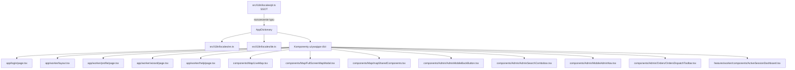

# Audyt i18n — brakujące klucze w plikach lokalizacyjnych

**Data:** 2026-05-28  
**Źródło słownika:** [`src/i18n/locales/pl.ts`](../src/i18n/locales/pl.ts) (972 linie, język polski = SSOT)  
**Do uzupełnienia:** [`src/i18n/locales/en.ts`](../src/i18n/locales/en.ts), [`src/i18n/locales/de.ts`](../src/i18n/locales/de.ts)

---

## Znalezione hardcodowane stringi

### 1. Login page — [`src/app/login/page.tsx`](../src/app/login/page.tsx)

| Linia | String | Sugerowany klucz |
|-------|--------|------------------|
| 112 | `System Logowania` | `login.systemLogin` lub `login.title` |
| 114 | `Panel dowodzenia i logistyki` | `login.subtitle` |
| 150 | `Login administratora` | `login.usernameLabel` |
| 158 | `login` (placeholder) | `login.usernamePlaceholder` |
| 164 | `Hasło` | `login.passwordLabel` |
| 172 | `••••••••` (placeholder) | `login.passwordPlaceholder` |

### 2. Worker layout — [`src/app/worker/layout.tsx`](../src/app/worker/layout.tsx)

| Linia | String | Sugerowany klucz |
|-------|--------|------------------|
| 65 | `Sesja` | `worker.client.session` lub `worker.nav.session` |
| 69 | `Historia` | `worker.nav.history` |
| 73 | `Profil` | `worker.nav.profile` |
| 77 | `Pomoc` | `worker.nav.help` |

### 3. Worker profile — [`src/app/worker/profile/page.tsx`](../src/app/worker/profile/page.tsx)

| Linia | String | Sugerowany klucz |
|-------|--------|------------------|
| 22 | `Brak dostępu` | `worker.profile.noAccess` |
| 31 | `Powrót do sesji` | `worker.profile.backToSession` |
| 34 | `Twój Profil` | `worker.profile.title` |
| 44 | `Administrator` / `Pracownik` | `worker.profile.roleAdmin` / `worker.profile.roleWorker` |
| 51 | `Login Systemowy:` | `worker.profile.systemLogin` |
| 60 | `Przejdź do Panelu Administratora` | `worker.profile.goToAdminPanel` |
| 74 | `Wyloguj z systemu` | `worker.profile.logout` |

### 4. Worker wizard — [`src/app/worker/wizard/page.tsx`](../src/app/worker/wizard/page.tsx)

| Linia | String | Sugerowany klucz |
|-------|--------|------------------|
| 28 | `Powrót do sesji` | `worker.wizard.backToSession` |

### 5. Worker help — [`src/app/worker/help/page.tsx`](../src/app/worker/help/page.tsx)

| Linia | String | Sugerowany klucz |
|-------|--------|------------------|
| 28 | `Powrót do sesji` | `worker.help.backToSession` |
| 57 | `Sesja` (w środku opisu) | już jest w `startWorkDesc1`/`startWorkDesc2` — OK |
| 65 | `ROZPOCZNIJ ZADANIE` (w środku opisu) | już jest w `startWorkInstruction`/`startWorkInstruction2` — OK |

### 6. Admin layout — [`src/app/admin/layout.tsx`](../src/app/admin/layout.tsx)

| Linia | String | Sugerowany klucz |
|-------|--------|------------------|
| 50, 81 | `WERKIT` (brand) | Brand — może pozostać, ale warto dodać do słownika dla spójności |
| 51, 82 | `v{APP_VERSION}` | Może pozostać (wersja) |

### 7. Admin components

#### [`src/components/Admin/AdminMobileBackButton.tsx`](../src/components/Admin/AdminMobileBackButton.tsx)

| Linia | String | Sugerowany klucz |
|-------|--------|------------------|
| 18 | `Wstecz` (aria-label) | `admin.ui.back` |

#### [`src/components/Admin/AdminSearchCombobox.tsx`](../src/components/Admin/AdminSearchCombobox.tsx)

| Linia | String | Sugerowany klucz |
|-------|--------|------------------|
| 51 | `Brak wyników` (default prop) | `admin.ui.noResults` |
| 52 | `Wyczyść` (default prop) | `admin.ui.clear` |

#### [`src/components/Admin/MobileAdminNav.tsx`](../src/components/Admin/MobileAdminNav.tsx)

| Linia | String | Sugerowany klucz |
|-------|--------|------------------|
| 109 | `Wyloguj` | `admin.sidebar.logoutSession` (już istnieje!) |

#### [`src/components/Admin/Orders/OrdersDispatchToolbar.tsx`](../src/components/Admin/Orders/OrdersDispatchToolbar.tsx)

| Linia | String | Sugerowany klucz |
|-------|--------|------------------|
| 76 | `Poprzednia strona` (title) | `admin.orders.previousPage` |
| 88 | `Następna strona` (title) | `admin.orders.nextPage` |

### 8. Map components

#### [`src/components/Map/LiveMap.tsx`](../src/components/Map/LiveMap.tsx)

| Linia | String | Sugerowany klucz |
|-------|--------|------------------|
| 354 | `Zdjęcie` / `Notatka` (popup event type) | `worker.client.photo` / `worker.client.note` lub `admin.map.eventPhoto` / `admin.map.eventNote` |
| 359 | `Zdarzenie` (alt text) | `admin.map.eventAlt` |

#### [`src/components/Map/FullScreenMapModal.tsx`](../src/components/Map/FullScreenMapModal.tsx)

| Linia | String | Sugerowany klucz |
|-------|--------|------------------|
| 144 | `Przycisk "Nawiguj"` (komentarz) | komentarz — nie wymaga tłumaczenia |
| 223 | `Zdjęcie` / `Notatka` (popup event type) | j.w. |

#### [`src/components/Map/mapSharedComponents.tsx`](../src/components/Map/mapSharedComponents.tsx)

| Linia | String | Sugerowany klucz |
|-------|--------|------------------|
| 91 | `Dodaj punkt pośredni — kliknij na mapie` (aria-label) | `admin.map.addWaypoint` |
| 92 | `Anuluj dodawanie` / `Dodaj punkt pośredni — kliknij na mapie` (title) | `admin.map.cancelAdd` / `admin.map.addWaypoint` |
| 106 | `Usuń punkt pośredni — kliknij marker` (aria-label) | `admin.map.removeWaypoint` |
| 107 | `Anuluj usuwanie` / `Usuń punkt pośredni — kliknij marker` (title) | `admin.map.cancelRemove` / `admin.map.removeWaypoint` |
| 120 | `Nawiguj` (aria-label) | `admin.map.navigate` |
| 121 | `Otwórz w Google Maps` (title) | `admin.map.openGoogleMaps` |
| 179 | `Center on my location` (aria-label) | `admin.map.centerOnLocation` |

### 9. Worker features

#### [`src/features/worker/components/ActiveSessionDashboard.tsx`](../src/features/worker/components/ActiveSessionDashboard.tsx)

| Linia | String | Sugerowany klucz |
|-------|--------|------------------|
| 254 | `Wymaga min. 1 zdjęcia` | `worker.client.requiresPhoto` |

---

## Podsumowanie — nowe klucze do dodania

### Nowe sekcje w słowniku (proponowane)

```typescript
// Sekcja login — rozszerzenie istniejącej
login: {
  // ... istniejące klucze
  systemLogin: "System Logowania",
  subtitle: "Panel dowodzenia i logistyki",
  usernameLabel: "Login administratora",
  usernamePlaceholder: "login",
  passwordLabel: "Hasło",
  passwordPlaceholder: "••••••••",
}

// Sekcja worker.nav — nowa
worker: {
  // ... istniejące klucze
  nav: {
    session: "Sesja",
    history: "Historia",
    profile: "Profil",
    help: "Pomoc",
  },
  profile: {
    noAccess: "Brak dostępu",
    backToSession: "Powrót do sesji",
    title: "Twój Profil",
    roleAdmin: "Administrator",
    roleWorker: "Pracownik",
    systemLogin: "Login Systemowy:",
    goToAdminPanel: "Przejdź do Panelu Administratora",
    logout: "Wyloguj z systemu",
  },
  wizard: {
    backToSession: "Powrót do sesji",
  },
  help: {
    backToSession: "Powrót do sesji",
  },
  client: {
    requiresPhoto: "Wymaga min. 1 zdjęcia",
    photo: "Zdjęcie",
    note: "Notatka",
  },
}

admin: {
  // ... istniejące klucze
  ui: {
    back: "Wstecz",
    noResults: "Brak wyników",
    clear: "Wyczyść",
  },
  orders: {
    previousPage: "Poprzednia strona",
    nextPage: "Następna strona",
  },
  map: {
    addWaypoint: "Dodaj punkt pośredni — kliknij na mapie",
    cancelAdd: "Anuluj dodawanie",
    removeWaypoint: "Usuń punkt pośredni — kliknij marker",
    cancelRemove: "Anuluj usuwanie",
    navigate: "Nawiguj",
    openGoogleMaps: "Otwórz w Google Maps",
    centerOnLocation: "Center on my location",
    eventPhoto: "Zdjęcie",
    eventNote: "Notatka",
    eventAlt: "Zdarzenie",
  },
}
```

### Uwagi

1. **`Wyloguj`** w [`MobileAdminNav.tsx`](../src/components/Admin/MobileAdminNav.tsx) (linia 109) — istnieje już klucz `admin.sidebar.logoutSession`, ale komponent nie używa słownika. Wystarczy podpiąć `dict`.
2. **`AdminSearchCombobox`** — `noResultsLabel` i `clearAriaLabel` to domyślne propsy. Komponent może przyjmować je z zewnątrz, ale domyślne wartości są hardcodowane. Można dodać klucze i przekazywać z góry.
3. **`AdminMobileBackButton`** — `aria-label="Wstecz"` — komponent nie ma dostępu do słownika (nie przyjmuje propsów). Trzeba dodać prop `dict` lub `backLabel`.
4. **Map components** — `LiveMap` i `FullScreenMapModal` już przyjmują `dict` przez props. Wystarczy dodać nowe klucze i podmienić stringi.
5. **`mapSharedComponents.tsx`** — `WaypointControls` i `LocateMeButton` nie przyjmują `dict`. Trzeba dodać prop.
6. **`ActiveSessionDashboard`** — już używa `dict` (linia 251: `{dict.finish}`). Wystarczy dodać klucz `requiresPhoto`.

---

## Plan implementacji

### Krok 1: Rozszerzenie typu `AppDictionary` w [`src/i18n/locales/pl.ts`](../src/i18n/locales/pl.ts)
Dodać wszystkie nowe klucze do polskiego słownika (SSOT).

### Krok 2: Aktualizacja [`src/i18n/locales/en.ts`](../src/i18n/locales/en.ts) i [`src/i18n/locales/de.ts`](../src/i18n/locales/de.ts)
Przetłumaczyć nowe klucze na angielski i niemiecki.

### Krok 3: Poprawki w komponentach

#### 3a. [`src/app/login/page.tsx`](../src/app/login/page.tsx)
- Dodać `getDictionary()` (lub przekazać `dict` z góry)
- Zastąpić hardcodowane stringi kluczami

#### 3b. [`src/app/worker/layout.tsx`](../src/app/worker/layout.tsx)
- Dodać `getDictionary()` 
- Zastąpić `Sesja`, `Historia`, `Profil`, `Pomoc` kluczami `worker.nav.*`

#### 3c. [`src/app/worker/profile/page.tsx`](../src/app/worker/profile/page.tsx)
- Dodać `getDictionary()`
- Zastąpić wszystkie hardcodowane stringi

#### 3d. [`src/app/worker/wizard/page.tsx`](../src/app/worker/wizard/page.tsx)
- Dodać `getDictionary()`
- Zastąpić `Powrót do sesji`

#### 3e. [`src/app/worker/help/page.tsx`](../src/app/worker/help/page.tsx)
- Dodać `getDictionary()` (już jest!)
- Zastąpić `Powrót do sesji` kluczem `worker.help.backToSession`

#### 3f. [`src/components/Admin/AdminMobileBackButton.tsx`](../src/components/Admin/AdminMobileBackButton.tsx)
- Dodać prop `ariaLabel?: string` z domyślnym `"Wstecz"`
- W admin layout przekazać `dict.admin.ui.back`

#### 3g. [`src/components/Admin/AdminSearchCombobox.tsx`](../src/components/Admin/AdminSearchCombobox.tsx)
- Dodać prop `noResultsLabel` i `clearAriaLabel` (już są jako default props)
- W miejscach użycia przekazać wartości ze słownika

#### 3h. [`src/components/Admin/MobileAdminNav.tsx`](../src/components/Admin/MobileAdminNav.tsx)
- Użyć istniejącego `dict.sidebar.logoutSession` zamiast hardcodowanego `"Wyloguj"`

#### 3i. [`src/components/Admin/Orders/OrdersDispatchToolbar.tsx`](../src/components/Admin/Orders/OrdersDispatchToolbar.tsx)
- Dodać `dict` i zastąpić `title` dla przycisków paginacji

#### 3j. [`src/components/Map/LiveMap.tsx`](../src/components/Map/LiveMap.tsx) i [`src/components/Map/FullScreenMapModal.tsx`](../src/components/Map/FullScreenMapModal.tsx)
- Dodać klucze `admin.map.eventPhoto`, `admin.map.eventNote`, `admin.map.eventAlt`
- Zastąpić hardcodowane stringi

#### 3k. [`src/components/Map/mapSharedComponents.tsx`](../src/components/Map/mapSharedComponents.tsx)
- Dodać prop `dict` do `WaypointControls` i `LocateMeButton`
- Zastąpić wszystkie `aria-label` i `title`

#### 3l. [`src/features/worker/components/ActiveSessionDashboard.tsx`](../src/features/worker/components/ActiveSessionDashboard.tsx)
- Dodać klucz `worker.client.requiresPhoto`
- Zastąpić `"Wymaga min. 1 zdjęcia"`

### Krok 4: Weryfikacja
- `npm run lint` — 0 błędów
- `npx tsc --noEmit` — 0 błędów
- Sprawdzić czy wszystkie locale (pl/en/de) mają te same klucze

---

## Mapa zależności


