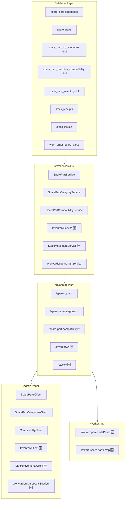

# DUR Module Completion Plan — Audit & Remediation

## Current State Assessment

After thorough codebase analysis, here's the verified state of the DUR (Spare Parts Warehouse) module:

### ✅ Phase 1 — Complete (Catalog + Admin API)
| Component | Status | Files |
|-----------|--------|-------|
| DB schema (`spare_parts`, `spare_part_categories`, N:M links, compatibility) | ✅ Done | [`src/db/schema.ts:321-413`](../src/db/schema.ts:321) |
| Migration SQL (`0020_dur_spare_parts.sql`) | ✅ Done | [`drizzle/0020_dur_spare_parts.sql`](../drizzle/0020_dur_spare_parts.sql) |
| Domain types (`SparePart`, `SparePartCategory`, etc.) | ✅ Done | [`src/types/dur.ts`](../src/types/dur.ts) |
| Services (CRUD: `SparePartService`, `SparePartCategoryService`, `SparePartCompatibilityService`) | ✅ Done | [`src/services/dur/`](../src/services/dur/) |
| API endpoints (`/api/dur/spare-parts/*`, `/api/dur/spare-part-categories/*`, `/api/dur/spare-part-compatibility/*`) | ✅ Done | [`src/app/api/dur/`](../src/app/api/dur/) |
| Narrow functions (`src/lib/narrow/dur.ts`) | ✅ Done | [`src/lib/narrow/dur.ts`](../src/lib/narrow/dur.ts) |
| i18n keys (`dur.*` in pl/en/de) | ✅ Done | [`src/i18n/locales/pl.ts:1097`](../src/i18n/locales/pl.ts:1097) |
| Admin UI: SparePartsCatalog + SparePartForm | ✅ Done | [`src/features/admin/dur/SparePartsClient.tsx`](../src/features/admin/dur/SparePartsClient.tsx) |
| Admin UI: SparePartCategories (tree) | ✅ Done | [`src/features/admin/dur/SparePartCategoriesClient.tsx`](../src/features/admin/dur/SparePartCategoriesClient.tsx) |
| Admin UI: Compatibility management | ✅ Done | [`src/features/admin/dur/CompatibilityClient.tsx`](../src/features/admin/dur/CompatibilityClient.tsx) |
| Admin nav links + routes | ✅ Done | [`src/components/Admin/adminNavLinks.ts:35`](../src/components/Admin/adminNavLinks.ts:35) |
| Tests (services + narrow) | ✅ Done | [`src/services/dur/*.test.ts`](../src/services/dur/), [`src/lib/narrow/dur.test.ts`](../src/lib/narrow/dur.test.ts) |

### 🟡 Phase 3 — Partial (DB + API for work order spare parts, NO UI)
| Component | Status | Files |
|-----------|--------|-------|
| DB schema (`work_order_spare_parts` table) | ✅ Done | [`src/db/schema.ts:419-437`](../src/db/schema.ts:419) |
| Service (`WorkOrderSparePartService`) | ✅ Done | [`src/services/dur/WorkOrderSparePartService.ts`](../src/services/dur/WorkOrderSparePartService.ts) |
| Admin API (`/api/admin/work-orders/[id]/spare-parts`) | ✅ Done | [`src/app/api/admin/work-orders/[id]/spare-parts/route.ts`](../src/app/api/admin/work-orders/[id]/spare-parts/route.ts) |
| Worker API (`/api/worker/work-orders/[id]/spare-parts`) | ✅ Done | [`src/app/api/worker/work-orders/[id]/spare-parts/route.ts`](../src/app/api/worker/work-orders/[id]/spare-parts/route.ts) |
| **Admin UI: spare parts section in work order edit form** | ❌ **Missing** | No component found in [`src/features/admin/orders/`](../src/features/admin/orders/) |
| **Worker UI: spare parts picker during active session** | ❌ **Missing** | No component found in [`src/features/worker/`](../src/features/worker/) |
| **Worker UI: spare parts in wizard (new repair order)** | ❌ **Missing** | No component found in [`src/features/worker/components/wizard/`](../src/features/worker/components/wizard/) |

### ❌ Phase 2 — Completely Missing (Warehouse Management)
| Component | Status |
|-----------|--------|
| `spare_part_inventory` table (DB + schema.ts) | ❌ Missing |
| `stock_receipts` table (DB + schema.ts) | ❌ Missing |
| `stock_issues` table (DB + schema.ts) | ❌ Missing |
| Migration SQL for Phase 2 tables | ❌ Missing |
| `InventoryService` | ❌ Missing |
| `StockMovementService` | ❌ Missing |
| API endpoints (`/api/dur/inventory/*`, `/api/dur/stock/*`) | ❌ Missing |
| Admin UI: Inventory view | ❌ Missing |
| Admin UI: Stock receipts/issues forms | ❌ Missing |
| i18n keys for inventory/stock | ❌ Missing |
| Narrow functions for inventory/stock | ❌ Missing |

### 🐛 Bug: Compatibility UI fetches wrong category endpoint

**Location:** [`src/features/admin/dur/CompatibilityClient.tsx:49`](../src/features/admin/dur/CompatibilityClient.tsx:49)

**Problem:** The `CompatibilityClient` fetches `/api/dur/spare-part-categories?leavesOnly=1` for the machine category dropdown. But machine categories are **`resource_categories`** (from `src/db/schema.ts`), not `spare_part_categories`. The `spare_part_machine_compatibility` table links to `resource_categories.id`, not `spare_part_categories.id`.

**Impact:** The dropdown shows spare part categories instead of machine (resource) categories. Users can select wrong categories, and the POST to `/api/dur/spare-part-compatibility` will likely fail with a foreign key violation or create invalid links.

**Same bug in** [`src/features/admin/dur/useSparePartsAdminData.ts:26`](../src/features/admin/dur/useSparePartsAdminData.ts:26) — the `machineCategories` state is populated from `spare-part-categories` instead of `resource-categories`.

---

## Remediation Plan

### Priority 1: Fix the Compatibility UI Bug 🐛

**Goal:** Make the compatibility UI correctly fetch `resource_categories` (machine types) instead of `spare_part_categories`.

**Steps:**
1. Check if there's an existing API endpoint for `resource_categories` (likely `/api/resource-categories` or similar)
2. Update [`CompatibilityClient.tsx`](../src/features/admin/dur/CompatibilityClient.tsx) to fetch from the correct endpoint
3. Update [`useSparePartsAdminData.ts`](../src/features/admin/dur/useSparePartsAdminData.ts) to fetch `resource_categories` for the `machineCategories` state
4. Verify the narrow function or create one for `resource_categories` if needed
5. Update the `CompatibilityRow` type if `resource_categories` has a different shape than `SparePartCategory`

### Priority 2: Phase 2 — Warehouse Management (Inventory + Stock Movements)

**Goal:** Implement inventory tracking, stock receipts, and stock issues.

**Steps:**

#### 2a. DB Schema + Migration
- Add `spare_part_inventory` table to [`src/db/schema.ts`](../src/db/schema.ts) (company_id, part_id, quantity, updated_at)
- Add `stock_receipts` table (company_id, part_id, quantity, unit_price, invoice_number, notes, created_by, created_at)
- Add `stock_issues` table (company_id, part_id, quantity, work_order_id, issued_to, notes, created_by, created_at)
- Add Drizzle relations for new tables
- Create migration SQL (`drizzle/0021_dur_warehouse.sql`)
- Update `drizzle/meta/_journal.json`
- Update `verify_schema_alignment.ts`

#### 2b. Domain Types
- Add types to [`src/types/dur.ts`](../src/types/dur.ts): `SparePartInventory`, `StockReceipt`, `StockIssue`, `StockReceiptInput`, `StockIssueInput`

#### 2c. Services
- Create [`src/services/dur/InventoryService.ts`](../src/services/dur/InventoryService.ts):
  - `getInventory(companyId)` — list all inventory records with part info
  - `getInventoryForPart(companyId, partId)` — single record
  - `adjustStock(companyId, partId, quantity)` — upsert inventory (used by receipts/issues)
  - `getLowStockItems(companyId)` — items where quantity < min_stock
- Create [`src/services/dur/StockMovementService.ts`](../src/services/dur/StockMovementService.ts):
  - `createReceipt(companyId, data)` — add stock receipt + update inventory
  - `createIssue(companyId, data)` — add stock issue + update inventory
  - `getReceipts(companyId)` — list receipts
  - `getIssues(companyId)` — list issues
  - `getMovementsForPart(companyId, partId)` — full history for a part

#### 2d. API Endpoints
- `GET/POST /api/dur/inventory` — list all / adjust stock
- `GET /api/dur/inventory/low-stock` — low stock alerts
- `GET/POST /api/dur/stock/receipts` — list / create receipt
- `GET/POST /api/dur/stock/issues` — list / create issue
- `GET /api/dur/stock/movements?partId=X` — movement history for a part

#### 2e. Narrow Functions
- Add to [`src/lib/narrow/dur.ts`](../src/lib/narrow/dur.ts): `narrowInventory`, `narrowStockReceipts`, `narrowStockIssues`

#### 2f. i18n
- Add keys to all 3 locales (`pl.ts`, `en.ts`, `de.ts`) under `dur.inventory.*`, `dur.stock.*`, `dur.apiErrors.*`

#### 2g. Admin UI
- Create [`src/features/admin/dur/InventoryClient.tsx`](../src/features/admin/dur/InventoryClient.tsx) — inventory overview with low-stock alerts
- Create [`src/features/admin/dur/StockMovementsClient.tsx`](../src/features/admin/dur/StockMovementsClient.tsx) — receipts/issues list + create forms
- Add routes: `/admin/dur/inventory`, `/admin/dur/stock`
- Add nav links in [`adminNavLinks.ts`](../src/components/Admin/adminNavLinks.ts)
- Add page files: `src/app/admin/dur/inventory/page.tsx`, `src/app/admin/dur/stock/page.tsx`

#### 2h. Tests
- `InventoryService.test.ts`
- `StockMovementService.test.ts`
- Narrow function tests

### Priority 3: Phase 3 — Complete UI for Spare Parts in Repair Orders

**Goal:** Build the end-to-end UI for selecting spare parts during repair order creation and execution.

#### 3a. Admin UI: Spare Parts Section in Work Order Edit Form
- Create a component (e.g., `WorkOrderSparePartsSection.tsx`) in `src/components/work-orders/` or `src/features/admin/orders/`
- Shows list of parts currently assigned to the work order
- "Add part" button opens a modal with:
  - Part search/select (filtered by machine category compatibility)
  - Quantity input
  - Unit price (auto-filled from part's purchase_price, editable)
  - Notes
- Edit/remove existing parts
- Uses existing API: `GET/POST /api/admin/work-orders/[id]/spare-parts`
- Integrate into the work order edit form/modal

#### 3b. Worker UI: Spare Parts Picker During Active Session
- Create a component in `src/features/worker/components/` (e.g., `WorkerSparePartsPanel.tsx`)
- Accessible from the active session dashboard when `orderType === 'machine_repair'`
- Shows compatible parts (filtered by `resource_categories` of the assigned machine)
- Mechanic can add parts with quantity during repair
- Uses existing API: `GET/POST /api/worker/work-orders/[id]/spare-parts`
- Shows current parts already added with quantities

#### 3c. Worker UI: Spare Parts in Wizard (New Repair Order)
- Extend the wizard (`src/features/worker/components/wizard/`) to include a spare parts step
- Only shown when the selected category has `orderType === 'machine_repair'`
- Allow pre-selecting parts before the order is created (or skip — parts can be added during execution)

### Priority 4: Proxy (Auth) — Verify Route Protection

**Goal:** Ensure all new routes are protected by the existing proxy.

- Check [`src/proxy.ts`](../src/proxy.ts) matcher includes `/api/dur/*` and `/admin/dur/*`
- Add any missing route patterns

### Priority 5: Documentation Updates

- Update [`docs/SYSTEM_MAP.md`](../docs/SYSTEM_MAP.md) §3 with new tables
- Update [`plans/dur-module-plan.md`](../plans/dur-module-plan.md) with completion status
- Update [`AGENTS.md`](../AGENTS.md) if any new patterns were introduced

---

## Execution Order Summary

| Order | Priority | Description | Dependencies |
|-------|----------|-------------|--------------|
| 1 | 🔴 High | Fix compatibility UI bug (wrong category endpoint) | None |
| 2 | 🔴 High | Phase 2: DB schema + migration for inventory/stock | None |
| 3 | 🔴 High | Phase 2: Services (InventoryService, StockMovementService) | #2 |
| 4 | 🔴 High | Phase 2: API endpoints | #3 |
| 5 | 🟡 Medium | Phase 2: Admin UI (Inventory, Stock movements) | #4 |
| 6 | 🟡 Medium | Phase 3: Admin UI — spare parts in work order form | None (uses existing API) |
| 7 | 🟡 Medium | Phase 3: Worker UI — spare parts picker in active session | None (uses existing API) |
| 8 | 🟢 Low | Phase 3: Worker wizard spare parts step | #7 patterns |
| 9 | 🟢 Low | Proxy verification + documentation | All above |

---

## Mermaid Diagram: DUR Module Architecture (Target State)

---

## Bug Detail: Compatibility UI

**File:** [`src/features/admin/dur/CompatibilityClient.tsx`](../src/features/admin/dur/CompatibilityClient.tsx)

**Line 49:** `fetch("/api/dur/spare-part-categories?leavesOnly=1")` — this fetches **spare part categories**, but the dropdown is labeled "machine categories" and the data is stored in `spare_part_machine_compatibility` which references `resource_categories.id`.

**Fix:** Change to fetch from the resource categories API endpoint (e.g., `/api/resource-categories?leavesOnly=1`). The narrow function must also be changed from `narrowSparePartCategories` to a suitable narrow function for resource categories.

**Same bug in** [`src/features/admin/dur/useSparePartsAdminData.ts`](../src/features/admin/dur/useSparePartsAdminData.ts) **line 26:** `fetch("/api/dur/spare-part-categories")` for `machineCategories`.
