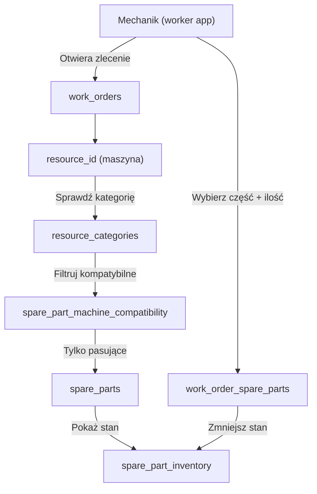

# Moduł DUR (Dział Utrzymania Ruchu) — plan architektoniczny

## 1. Kontekst biznesowy

**DUR = Dział Utrzymania Ruchu** w firmie. Aplikacja ma być uniwersalna — już działa tworzenie zleceń naprawy maszyn (istniejące `work_orders`). Brakuje **magazynu części zamiennych**, które mechanik może wybrać podczas naprawy.

**Kluczowe założenie:** części są przypisane do **typu/kategorii maszyny** (np. "koparka gąsiennicowa"), a nie do konkretnego egzemplarza. Jeśli na hali jest 10 koparek tego samego modelu, część pasuje do wszystkich.

## 2. Decyzja architektoniczna: osobny moduł, nie rozszerzenie `materials`

**Części zamienne ≠ materiały sypkie.** Różnice:

| Cecha | Materiały (obecne) | Części zamienne (DUR) |
|-------|-------------------|----------------------|
| Charakter | Piasek, żwir, kruszywo (sypkie, mierzone w tonach) | Łożyska, filtry, uszczelki (sztuki, numer katalogowy) |
| Jednostka | Tony (quantity_tons) | Sztuki (quantity) |
| Cena | Brak | Potrzebna (cena zakupu) |
| Stan magazynowy | Brak | Kluczowy (ile sztuk na stanie, min stan) |
| Katalogowanie | Nazwa + kategoria | Nr katalogowy, producent |
| Kompatybilność | Nie dotyczy | Z **kategorią maszyny** (`resource_categories`) |
| Lokalizacja w magazynie | Nie dotyczy | Potrzebna (regal, półka) |

**Wniosek:** Nowa tabela `spare_parts` (osobna od `materials`), z własnymi serwisami, API, UI.

## 3. Zakres modułu DUR (fazy)

### Faza 1 — Magazyn części (podstawa)
- Tabela `spare_parts` + kategorie części (`spare_part_categories`)
- CRUD dla części zamiennych (panel admin)
- Katalogowanie: nazwa, nr katalogowy, producent, jednostka miary, cena, lokalizacja w magazynie
- Kategorie części (hierarchiczne, wzorowane na `material_categories`)
- **Kompatybilność części z kategoriami maszyn** (`resource_categories`) — N:M

### Faza 2 — Gospodarka magazynowa
- Stan magazynowy (`spare_part_inventory`)
- Przyjęcia na magazyn (`stock_receipts`)
- Wydania z magazynu (`stock_issues`)
- Minimalny stan (alert przy niskim stanie)

### Faza 3 — Części w zleceniach naprawczych
- Rozszerzenie istniejących `work_orders` / `work_sessions` o możliwość wyboru części
- Nowa tabela `work_order_spare_parts` — które części użyte w naprawie
- Mechanik widzi tylko części kompatybilne z kategorią maszyny ze zlecenia

## 4. Schemat DB

```sql
-- Kategorie części zamiennych (hierarchiczne)
CREATE TABLE spare_part_categories (
  id SERIAL PRIMARY KEY,
  company_id INTEGER NOT NULL REFERENCES companies(id) ON DELETE CASCADE,
  name VARCHAR(255) NOT NULL,
  parent_id INTEGER REFERENCES spare_part_categories(id) ON DELETE SET NULL,
  is_group BOOLEAN NOT NULL DEFAULT false,
  sort_order INTEGER NOT NULL DEFAULT 0,
  color VARCHAR(50) DEFAULT '#3f3f46'
);

-- Części zamienne
CREATE TABLE spare_parts (
  id SERIAL PRIMARY KEY,
  company_id INTEGER NOT NULL REFERENCES companies(id) ON DELETE CASCADE,
  name VARCHAR(255) NOT NULL,                       -- nazwa handlowa
  catalog_number VARCHAR(255) NOT NULL DEFAULT '',   -- numer katalogowy OEM
  manufacturer VARCHAR(255) NOT NULL DEFAULT '',     -- producent
  unit VARCHAR(50) NOT NULL DEFAULT 'szt',           -- jednostka miary
  purchase_price NUMERIC(10,2),                      -- cena zakupu netto
  description TEXT,                                  -- opis / uwagi
  min_stock NUMERIC(10,2) NOT NULL DEFAULT 0,        -- minimalny stan (alert)
  location VARCHAR(255) NOT NULL DEFAULT '',          -- lokalizacja w magazynie (np. A1-12)
  image_url TEXT,                                    -- zdjęcie części
  is_active BOOLEAN NOT NULL DEFAULT true,
  created_at TIMESTAMP NOT NULL DEFAULT NOW()
);

-- Przypisanie części do kategorii części (N:M)
CREATE TABLE spare_part_to_categories (
  part_id INTEGER NOT NULL REFERENCES spare_parts(id) ON DELETE CASCADE,
  category_id INTEGER NOT NULL REFERENCES spare_part_categories(id) ON DELETE CASCADE,
  PRIMARY KEY (part_id, category_id)
);

-- Kompatybilność części z KATEGORIAMI maszyn (N:M)
-- Część pasuje do wszystkich maszyn danej kategorii (np. "koparka gąsiennicowa")
CREATE TABLE spare_part_machine_compatibility (
  part_id INTEGER NOT NULL REFERENCES spare_parts(id) ON DELETE CASCADE,
  category_id INTEGER NOT NULL REFERENCES resource_categories(id) ON DELETE CASCADE,
  notes VARCHAR(255),                                -- uwagi (np. "tylko silnik XYZ")
  PRIMARY KEY (part_id, category_id)
);

-- Stan magazynowy (Faza 2)
CREATE TABLE spare_part_inventory (
  id SERIAL PRIMARY KEY,
  company_id INTEGER NOT NULL REFERENCES companies(id) ON DELETE CASCADE,
  part_id INTEGER NOT NULL REFERENCES spare_parts(id) ON DELETE CASCADE,
  quantity NUMERIC(10,2) NOT NULL DEFAULT 0,
  updated_at TIMESTAMP NOT NULL DEFAULT NOW(),
  UNIQUE (company_id, part_id)
);

-- Przyjęcia magazynowe (Faza 2)
CREATE TABLE stock_receipts (
  id SERIAL PRIMARY KEY,
  company_id INTEGER NOT NULL REFERENCES companies(id) ON DELETE CASCADE,
  part_id INTEGER NOT NULL REFERENCES spare_parts(id) ON DELETE CASCADE,
  quantity NUMERIC(10,2) NOT NULL,
  unit_price NUMERIC(10,2),
  invoice_number VARCHAR(255),
  notes TEXT,
  created_by INTEGER REFERENCES users(id) ON DELETE SET NULL,
  created_at TIMESTAMP NOT NULL DEFAULT NOW()
);

-- Wydania magazynowe (Faza 2)
CREATE TABLE stock_issues (
  id SERIAL PRIMARY KEY,
  company_id INTEGER NOT NULL REFERENCES companies(id) ON DELETE CASCADE,
  part_id INTEGER NOT NULL REFERENCES spare_parts(id) ON DELETE CASCADE,
  quantity NUMERIC(10,2) NOT NULL,
  work_order_id INTEGER REFERENCES work_orders(id) ON DELETE SET NULL,  -- powiązanie ze zleceniem
  issued_to INTEGER REFERENCES users(id) ON DELETE SET NULL,
  notes TEXT,
  created_by INTEGER REFERENCES users(id) ON DELETE SET NULL,
  created_at TIMESTAMP NOT NULL DEFAULT NOW()
);

-- Części użyte w zleceniu naprawczym (Faza 3)
CREATE TABLE work_order_spare_parts (
  id SERIAL PRIMARY KEY,
  work_order_id INTEGER NOT NULL REFERENCES work_orders(id) ON DELETE CASCADE,
  part_id INTEGER NOT NULL REFERENCES spare_parts(id) ON DELETE CASCADE,
  quantity NUMERIC(10,2) NOT NULL DEFAULT 1,
  unit_price NUMERIC(10,2),                          -- cena w momencie użycia
  notes TEXT,
  created_at TIMESTAMP NOT NULL DEFAULT NOW()
);
```

## 5. Relacje

```
spare_parts ──N:M── spare_part_categories       (kategoryzacja części)
spare_parts ──N:M── resource_categories          (kompatybilność: część pasuje do TYPU maszyny)
spare_parts ───1:1── spare_part_inventory        (stan magazynowy)
spare_parts ───1:N── stock_receipts              (historia przyjęć)
spare_parts ───1:N── stock_issues                (historia wydań)
spare_parts ───1:N── work_order_spare_parts      (części użyte w zleceniu)

work_orders ───1:N── work_order_spare_parts      (zlecenie → użyte części)
work_orders.resource_id ──► resources.id         (maszyna naprawiana)
resources ──N:M── resource_categories            (maszyna → jej kategorie)

resource_categories ──N:M── spare_parts          (przez spare_part_machine_compatibility)
```

## 6. Diagram przepływu — wybór części w zleceniu naprawczym (Faza 3)



## 7. Architektura modułu (struktura katalogów)

```
src/
├── features/
│   └── dur/                              # NOWY: moduł DUR
│       ├── components/
│       │   ├── SparePartsCatalog/         # Katalog części (admin)
│       │   ├── SparePartForm/             # Formularz dodawania/edycji części
│       │   ├── SparePartCategories/       # Drzewo kategorii części
│       │   ├── SparePartCompatibility/    # Kompatybilność z kategoriami maszyn
│       │   ├── Inventory/                # Stan magazynowy (Faza 2)
│       │   ├── StockMovements/           # Przyjęcia/wydania (Faza 2)
│       │   └── WorkOrderParts/           # Wybór części w zleceniu (Faza 3)
│       ├── hooks/
│       └── lib/
├── services/
│   ├── dur/                              # NOWE: serwisy DUR
│   │   ├── SparePartService.ts           # CRUD części
│   │   ├── SparePartCategoryService.ts   # Kategorie części
│   │   ├── SparePartCompatibilityService.ts # Kompatybilność z kategoriami maszyn
│   │   ├── InventoryService.ts           # Stan magazynowy (Faza 2)
│   │   └── StockMovementService.ts       # Przyjęcia/wydania (Faza 2)
│   └── ... (istniejące)
├── app/
│   ├── api/
│   │   ├── dur/                          # NOWE: API DUR
│   │   │   ├── spare-parts/              # CRUD części
│   │   │   ├── spare-part-categories/    # Kategorie
│   │   │   ├── spare-part-compatibility/ # Kompatybilność z kategoriami maszyn
│   │   │   ├── inventory/               # Stan magazynowy (Faza 2)
│   │   │   └── stock/                   # Przyjęcia/wydania (Faza 2)
│   │   └── ... (istniejące)
│   ├── admin/
│   │   └── dur/                          # NOWE: panel admina DUR
│   │       ├── page.tsx                  # Dashboard DUR
│   │       ├── spare-parts/              # Katalog części
│   │       ├── categories/               # Kategorie części
│   │       ├── inventory/                # Stan magazynowy (Faza 2)
│   │       └── stock/                   # Ruchy magazynowe (Faza 2)
│   └── ... (istniejące)
├── types/
│   └── dur.ts                            # NOWE: typy domenowe DUR
└── i18n/
    └── locales/
        ├── pl.ts                         # NOWE: klucze i18n dla DUR
        ├── en.ts
        └── de.ts
```

## 8. Kluczowe decyzje projektowe

1. **Osobna tabela `spare_parts`** — nie rozszerzamy `materials`. Części mają inne atrybuty.
2. **Kompatybilność z kategoriami maszyn** (`resource_categories`), a nie z konkretnymi `resources`. Część pasuje do wszystkich maszyn danej kategorii.
3. **Stan magazynowy osobno** — `spare_part_inventory` (1:1 z `spare_parts`) dla wydajności i audytu.
4. **Multi-tenant** — wszystkie tabele DUR mają `company_id`.
5. **Proxy (auth)** — istniejący `src/proxy.ts` chroni trasy `/api/dur/*` i `/admin/dur/*`.
6. **i18n** — nowe klucze w istniejących plikach lokalizacyjnych, sekcja `dur.*`.
7. **Type narrowing** — nowe funkcje `narrow*` w `src/lib/narrow/dur.ts`.
8. **Serwisy statyczne** — zgodnie z istniejącym wzorcem (klasy z metodami `static`).
9. **Fazy** — implementacja fazami, zaczynając od Fazy 1 (magazyn części).

## 9. Plan implementacji (kolejność)

### Krok 1: Schemat DB + migracja
- Dodać tabele do `src/db/schema.ts`:
  - `sparePartCategories`
  - `spareParts`
  - `sparePartToCategories`
  - `sparePartMachineCompatibility`
- Stworzyć migrację SQL (`drizzle/0020_dur_spare_parts.sql`)
- Zaktualizować `drizzle/meta/_journal.json`
- Zaktualizować `verify_schema_alignment.ts`
- Uruchomić migrację na bazie

### Krok 2: Typy domenowe
- Stworzyć `src/types/dur.ts` z interfejsami

### Krok 3: Serwisy
- `SparePartService` — CRUD części
- `SparePartCategoryService` — CRUD kategorii (wzorowany na `MaterialCategoryService`)
- `SparePartCompatibilityService` — zarządzanie kompatybilnością z kategoriami maszyn

### Krok 4: API endpoints
- `GET/POST /api/dur/spare-parts`
- `GET/PUT/DELETE /api/dur/spare-parts/[id]`
- `GET/POST /api/dur/spare-part-categories`
- `GET/PUT/DELETE /api/dur/spare-part-categories/[id]`
- `GET/POST /api/dur/spare-part-compatibility`
- `DELETE /api/dur/spare-part-compatibility/[id]`

### Krok 5: Narrow functions
- `src/lib/narrow/dur.ts`

### Krok 6: i18n
- Klucze `dur.*` w `pl.ts`, `en.ts`, `de.ts`

### Krok 7: UI Admin — katalog części
- Strona `/admin/dur` z dashboardem
- `SparePartsCatalog` — lista części z wyszukiwarką/filtrowaniem
- `SparePartForm` — dodawanie/edycja części
- `SparePartCategories` — drzewo kategorii
- `SparePartCompatibility` — przypisywanie do kategorii maszyn

### Krok 8: Proxy (auth)
- Dodać trasy do matchera w `proxy.ts`

### Krok 9: Testy
- Testy serwisów
- Testy narrow functions

### Krok 10: Dokumentacja
- Zaktualizować `docs/SYSTEM_MAP.md`
- Zaktualizować `AGENTS.md` jeśli potrzeba
