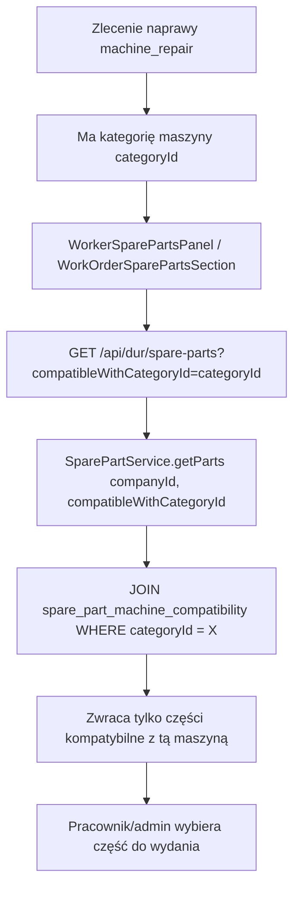
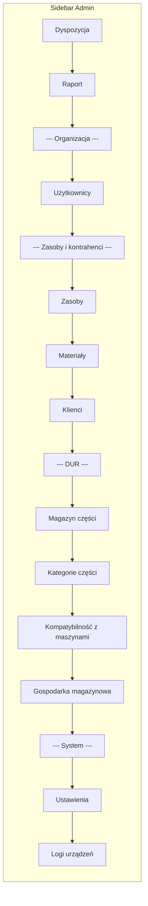

# Plan: DUR — Grupy zasobów/maszyn + przepływ magazynowy

## 1. Cel

1. **Zmień etykietę nawigacyjną** — sekcja "Zlecenia i Dyspozycja" → "DUR" (bo dotyczy tylko DUR).
2. **Dodaj grupy do zasobów/maszyn** — kategorie maszyn (`resource_categories`) już mają `is_group`, ale brakuje UI do zarządzania grupami w kontekście **grup maszyn** (nie mylić z kategoriami zleceń). Grupy maszyn służą do przypisywania części naprawczych do konkretnych typów maszyn.
3. **Filtrowanie części w magazynie po grupie maszyn** — gdy pracownik ma zlecenie naprawy kapsułkarki, widzi tylko części przypisane do tej grupy maszyn.

---

## 2. Analiza stanu obecnego

### 2.1. Co już istnieje

| Element | Status | Lokalizacja |
|---------|--------|-------------|
| `resource_categories` z `is_group`, `parent_id`, `sort_order` | ✅ Istnieje | [`src/db/schema.ts:53-86`](../src/db/schema.ts:53) |
| `order_type` (`machine_work` / `machine_repair`) na kategorii | ✅ Istnieje | [`src/db/schema.ts:85`](../src/db/schema.ts:85) |
| `spare_part_machine_compatibility` (część ↔ kategoria maszyny) | ✅ Istnieje | [`src/db/schema.ts:437-451`](../src/db/schema.ts:437) |
| `SparePartCompatibilityService` | ✅ Istnieje | [`src/services/dur/SparePartCompatibilityService.ts`](../src/services/dur/SparePartCompatibilityService.ts) |
| Admin UI: kategorie maszyn (MachinesClient) | ✅ Istnieje | [`src/features/admin/machines/`](../src/features/admin/machines/) |
| Admin UI: kompatybilność części z maszynami | ✅ Istnieje | [`src/features/admin/dur/CompatibilityClient.tsx`](../src/features/admin/dur/CompatibilityClient.tsx) |
| Worker UI: panel części w sesji naprawczej | ✅ Istnieje | [`src/features/worker/components/WorkerSparePartsPanel.tsx`](../src/features/worker/components/WorkerSparePartsPanel.tsx) |
| Admin UI: sekcja części w formularzu zlecenia | ✅ Istnieje | [`src/components/Admin/Modals/WorkOrderSparePartsSection.tsx`](../src/components/Admin/Modals/WorkOrderSparePartsSection.tsx) |
| Sidebar nav z sekcją DUR | ✅ Istnieje | [`src/components/Admin/adminNavLinks.ts`](../src/components/Admin/adminNavLinks.ts) |
| i18n: `admin.sidebar.ordersAndDispatch` | ✅ Istnieje | [`src/i18n/locales/pl.ts:118`](../src/i18n/locales/pl.ts:118) |
| i18n: `dur.sidebar.*` | ✅ Istnieje | [`src/i18n/locales/pl.ts:1142-1147`](../src/i18n/locales/pl.ts:1142) |

### 2.2. Co trzeba zmienić / dodać

| # | Zmiana | Opis |
|---|--------|------|
| 1 | **Sidebar: zmiana etykiety sekcji** | `ordersAndDispatch` → `dur` (np. "DUR" / "Maintenance") |
| 2 | **Sidebar: reorganizacja linków DUR** | Przenieś linki DUR pod sekcję "DUR" zamiast pod "Zlecenia i Dyspozycja" |
| 3 | **Filtrowanie części w WorkerSparePartsPanel** | Gdy pracownik dodaje część do zlecenia naprawy, pokaż tylko części kompatybilne z kategorią maszyny z tego zlecenia |
| 4 | **Filtrowanie części w WorkOrderSparePartsSection (admin)** | Analogicznie — admin widzi tylko części pasujące do kategorii maszyny zlecenia |
| 5 | **i18n: nowe klucze** | `admin.sidebar.dur` (etykieta sekcji), aktualizacja PL/EN/DE |

---

## 3. Szczegółowy plan zmian

### Krok 1: Zmiana etykiety sidebar — "Zlecenia i Dyspozycja" → "DUR"

**Pliki do zmiany:**

1. [`src/i18n/locales/pl.ts`](../src/i18n/locales/pl.ts) — linia 118:
   - `ordersAndDispatch: "Zlecenia i Dyspozycja"` → `ordersAndDispatch: "DUR"` (lub nowy klucz `dur: "DUR"`)
   
2. [`src/i18n/locales/en.ts`](../src/i18n/locales/en.ts) — linia 117:
   - `ordersAndDispatch: "Orders & Dispatch"` → `ordersAndDispatch: "DUR"` (lub nowy klucz)
   
3. [`src/i18n/locales/de.ts`](../src/i18n/locales/de.ts) — linia 121:
   - Analogicznie

**Decyzja:** Użyj istniejącego klucza `ordersAndDispatch` ale zmień wartość na "DUR" we wszystkich językach. To najprostsza zmiana — sekcja w sidebarze i tak pokazuje tylko linki DUR.

### Krok 2: Reorganizacja linków w sidebarze

Obecnie w [`src/components/Admin/adminNavLinks.ts`](../src/components/Admin/adminNavLinks.ts) sekcja `ordersAndDispatch` zawiera tylko linki DUR (spareParts, warehouse). Po zmianie etykiety na "DUR" struktura jest logiczna.

**Nie ma potrzeby zmian w kodzie** — wystarczy zmiana i18n.

### Krok 3: Filtrowanie części w WorkerSparePartsPanel

**Problem:** Gdy pracownik otwiera panel części w trakcie naprawy, widzi **wszystkie** części z katalogu, a nie tylko te kompatybilne z maszyną, którą naprawia.

**Rozwiązanie:** [`WorkerSparePartsPanel.tsx`](../src/features/worker/components/WorkerSparePartsPanel.tsx) pobiera katalog części z `/api/dur/spare-parts`. Należy:

1. Dodać props `machineCategoryId: number | null` — ID kategorii maszyny przypisanej do zlecenia.
2. W fetczu katalogu (`fetchCatalog`) dodać query param `?compatibleWithCategoryId=X`.
3. W [`SparePartService.getParts()`](../src/services/dur/SparePartService.ts) dodać opcjonalny filtr `compatibleWithCategoryId`:
   - Jeśli podany, JOIN z `spare_part_machine_compatibility` i filtr WHERE `categoryId = X`.
4. W API [`/api/dur/spare-parts/route.ts`](../src/app/api/dur/spare-parts/route.ts) dodać obsługę query param `compatibleWithCategoryId`.

**Pliki do zmiany:**

| Plik | Zmiana |
|------|--------|
| [`src/services/dur/SparePartService.ts`](../src/services/dur/SparePartService.ts) | Dodaj opcjonalny parametr `compatibleWithCategoryId?: number` do `getParts()` |
| [`src/app/api/dur/spare-parts/route.ts`](../src/app/api/dur/spare-parts/route.ts) | Parsuj `?compatibleWithCategoryId=` i przekaż do serwisu |
| [`src/features/worker/components/WorkerSparePartsPanel.tsx`](../src/features/worker/components/WorkerSparePartsPanel.tsx) | Dodaj props `machineCategoryId`, przekaż do fetcza katalogu |
| [`src/features/worker/components/ActiveSessionDashboard.tsx`](../src/features/worker/components/ActiveSessionDashboard.tsx) | Przekaż `machineCategoryId` (z sesji → `categoryId`) do `WorkerSparePartsPanel` |

### Krok 4: Filtrowanie części w WorkOrderSparePartsSection (admin)

Analogicznie jak krok 3, ale dla panelu admina.

**Pliki do zmiany:**

| Plik | Zmiana |
|------|--------|
| [`src/components/Admin/Modals/WorkOrderSparePartsSection.tsx`](../src/components/Admin/Modals/WorkOrderSparePartsSection.tsx) | Dodaj props `machineCategoryId`, filtruj katalog przy dodawaniu części |
| [`src/components/Admin/Modals/OrderFormFields.tsx`](../src/components/Admin/Modals/OrderFormFields.tsx) | Przekaż `machineCategoryId` (z `form.categoryId`) do `WorkOrderSparePartsSection` |

### Krok 5: i18n — nowe/zmienione klucze

**pl.ts:**
```typescript
// linia 118: zmiana
ordersAndDispatch: "DUR",
```

**en.ts:**
```typescript
// linia 117: zmiana
ordersAndDispatch: "DUR",
```

**de.ts:**
```typescript
// linia 121: zmiana
ordersAndDispatch: "DUR",
```

---

## 4. Diagram przepływu — filtrowanie części po grupie maszyn



---

## 5. Diagram — struktura sidebaru po zmianie



---

## 6. Podsumowanie zmian — lista todo

```markdown
[x] Analyze current codebase
[ ] 1. Zmień etykietę `ordersAndDispatch` na "DUR" w pl.ts, en.ts, de.ts
[ ] 2. Dodaj opcjonalny filtr `compatibleWithCategoryId` do SparePartService.getParts()
[ ] 3. Dodaj obsługę query param w API /api/dur/spare-parts
[ ] 4. Dodaj props `machineCategoryId` do WorkerSparePartsPanel i filtruj katalog
[ ] 5. Przekaż `categoryId` z sesji do WorkerSparePartsPanel w ActiveSessionDashboard
[ ] 6. Dodaj props `machineCategoryId` do WorkOrderSparePartsSection i filtruj katalog
[ ] 7. Przekaż `categoryId` z formularza do WorkOrderSparePartsSection w OrderFormFields
[ ] 8. Uruchom `npm run lint` i `npx tsc --noEmit` dla weryfikacji
[ ] 9. Uruchom testy `npm test`
```
