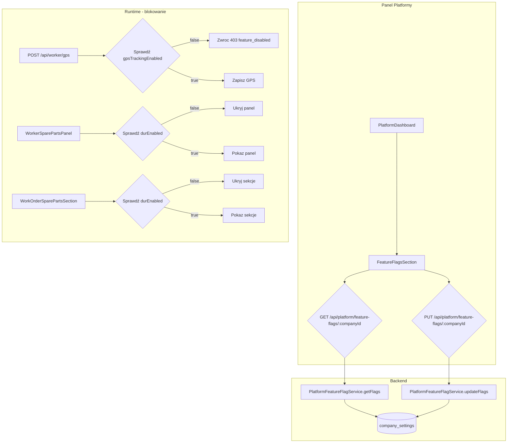

# Plan: Feature flags GPS + DUR w panelu platformy

## Cel

Umożliwienie superadminowi włączania/wyłączania modułów GPS (śledzenie, mapa, geofencing, trasa, nawigacja) oraz DUR (części zamienne, magazyn) per organizacja z panelu platformy (`/platform`).

---

## Architektura



---

## Krok po kroku

### Krok 1: Migracja DB — kolumna `dur_enabled`

**Plik:** `drizzle/0023_feature_flags_dur.sql`

```sql
ALTER TABLE company_settings ADD COLUMN IF NOT EXISTS dur_enabled BOOLEAN NOT NULL DEFAULT false;
```

Domyślnie `false` — DUR jest zaawansowanym modułem, organizacje włączają go świadomie.

### Krok 2: Aktualizacja `schema.ts`

Dodać w `companySettings`:
```typescript
durEnabled: boolean('dur_enabled').notNull().default(false),
```

### Krok 3: Aktualizacja `FeatureFlags` typu

**Plik:** `src/types/featureFlags.ts`

Dodać:
```typescript
durEnabled: boolean;
```

Do `DEFAULT_FEATURE_FLAGS`, `FEATURE_FLAG_KEYS`, `FEATURE_FLAG_LABELS`.

### Krok 4: Nowy serwis `PlatformFeatureFlagService`

**Plik:** `src/services/PlatformFeatureFlagService.ts`

- `static async getFlags(companyId: number): Promise<FeatureFlags>` — SELECT z `company_settings`
- `static async updateFlags(companyId: number, flags: Partial<FeatureFlags>): Promise<FeatureFlags>` — UPSERT do `company_settings`

Wykorzystuje istniejący `SettingsService` jako bazę, ale zwraca tylko flagi.

### Krok 5: Nowy endpoint API

**Plik:** `src/app/api/platform/feature-flags/[companyId]/route.ts`

- `GET` — zwraca `FeatureFlags` dla firmy
- `PUT` — przyjmuje `Partial<FeatureFlags>`, aktualizuje, zwraca nowy stan
- Autoryzacja: tylko superadmin (`requireSuperadminSession`)

### Krok 6: Nowy komponent UI `FeatureFlagsSection`

**Plik:** `src/components/Platform/FeatureFlagsSection.tsx`

- Props: `companyId: number`, `dict: AppDictionary['platform']['settings']`
- Stan: `FeatureFlags` (załadowane z GET)
- Render: lista checkboxów z etykietami i hintami (i18n)
- Przycisk "Zapisz" → PUT z tylko zmienionymi flagami
- Feedback: `saveSuccess` / `saveError` z i18n

### Krok 7: Integracja w `PlatformDashboard`

**Plik:** `src/components/Platform/PlatformDashboard.tsx`

- Dodać przycisk "Ustawienia funkcji" per wiersz firmy w tabeli
- Po kliknięciu: rozwija `FeatureFlagsSection` pod wierszem (lub modal)
- Przekazuje `companyId` i `dict.settings`

### Krok 8: i18n — nowe klucze `durEnabled`

We wszystkich 3 locale (`pl.ts`, `en.ts`, `de.ts`) w sekcji `platform.settings`:

```typescript
durEnabled: "Moduł DUR (części zamienne)",
durEnabledHint: "Zarządzanie częściami zamiennymi i magazynem w zleceniach naprawczych.",
```

### Krok 9: Logika blokująca GPS w runtime

**Plik:** `src/app/api/worker/gps/route.ts`

W `POST` i `GET` — po `requireWorkerCompanySession()` dodać:

```typescript
const flags = await PlatformFeatureFlagService.getFlags(ctx.companyId);
if (!flags.gpsTrackingEnabled) {
  return jsonError('feature_disabled', 403);
}
```

### Krok 10: Logika blokująca DUR w worker UI

**Plik:** `src/features/worker/components/WorkerSparePartsPanel.tsx`

Przy renderowaniu sprawdzić flagę `durEnabled` dla organizacji. Jeśli `false` — nie renderować panelu.

Potrzebny będzie helper do pobrania flag z API (lub dołączenie flag do `InitialWorkerData`).

**Opcja A (preferowana):** Dołączyć `featureFlags` do odpowiedzi `GET /api/worker/session` (w `InitialWorkerData`). Wtedy worker ma flagi od razu, bez dodatkowego fetcha.

**Opcja B:** Osobny fetch `GET /api/platform/feature-flags/:companyId` z cache'owaniem.

### Krok 11: Logika blokująca DUR w admin UI

**Plik:** `src/components/Admin/Modals/WorkOrderSparePartsSection.tsx`

Analogicznie — sprawdzić `durEnabled` przed renderowaniem. Admin może pobrać flagi przez `GET /api/platform/feature-flags/:companyId` (wymaga superadmina) lub przez dedykowany endpoint dla admina.

**Propozycja:** Dodać flagi do odpowiedzi `GET /api/admin/company-settings` (już istnieje przez `SettingsService`).

### Krok 12: Testy

- `PlatformFeatureFlagService.test.ts` — getFlags, updateFlags
- Test integracyjny endpointu `GET/PUT /api/platform/feature-flags/:companyId`
- Test blokady GPS w `POST /api/worker/gps` gdy `gpsTrackingEnabled = false`

### Krok 13: Dokumentacja

- `docs/SYSTEM_MAP.md` — dodać wpis o `PlatformFeatureFlagService`, endpointzie, `FeatureFlagsSection`
- `AGENTS.md` — zaktualizować listę serwisów

---

## Podsumowanie plików do zmiany

| Plik | Operacja |
|------|----------|
| `drizzle/0023_feature_flags_dur.sql` | CREATE |
| `src/db/schema.ts` | EDIT (dodać `durEnabled`) |
| `src/types/featureFlags.ts` | EDIT (dodać `durEnabled`) |
| `src/services/PlatformFeatureFlagService.ts` | CREATE |
| `src/app/api/platform/feature-flags/[companyId]/route.ts` | CREATE |
| `src/components/Platform/FeatureFlagsSection.tsx` | CREATE |
| `src/components/Platform/PlatformDashboard.tsx` | EDIT (integracja) |
| `src/i18n/locales/pl.ts` | EDIT (klucze `durEnabled`) |
| `src/i18n/locales/en.ts` | EDIT (klucze `durEnabled`) |
| `src/i18n/locales/de.ts` | EDIT (klucze `durEnabled`) |
| `src/app/api/worker/gps/route.ts` | EDIT (blokada GPS) |
| `src/features/worker/components/WorkerSparePartsPanel.tsx` | EDIT (blokada DUR) |
| `src/components/Admin/Modals/WorkOrderSparePartsSection.tsx` | EDIT (blokada DUR) |
| `docs/SYSTEM_MAP.md` | EDIT |
| `AGENTS.md` | EDIT |
