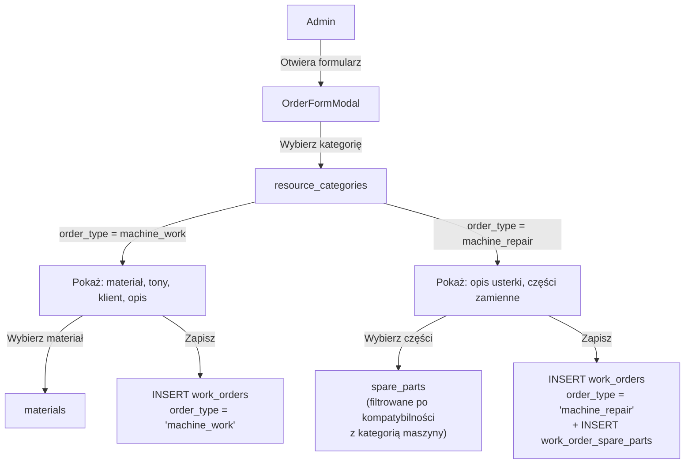
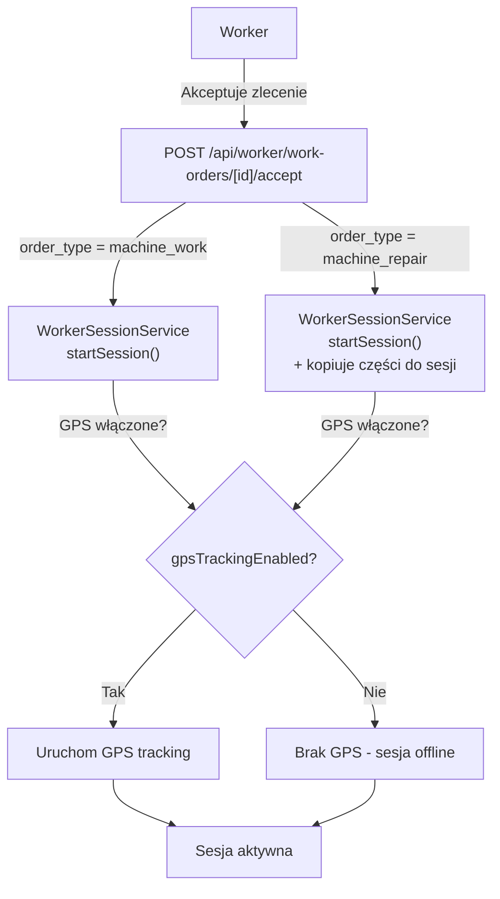
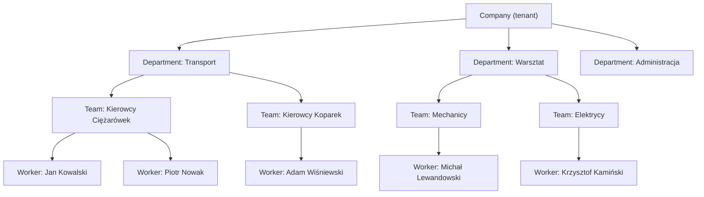
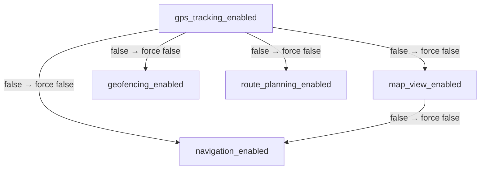
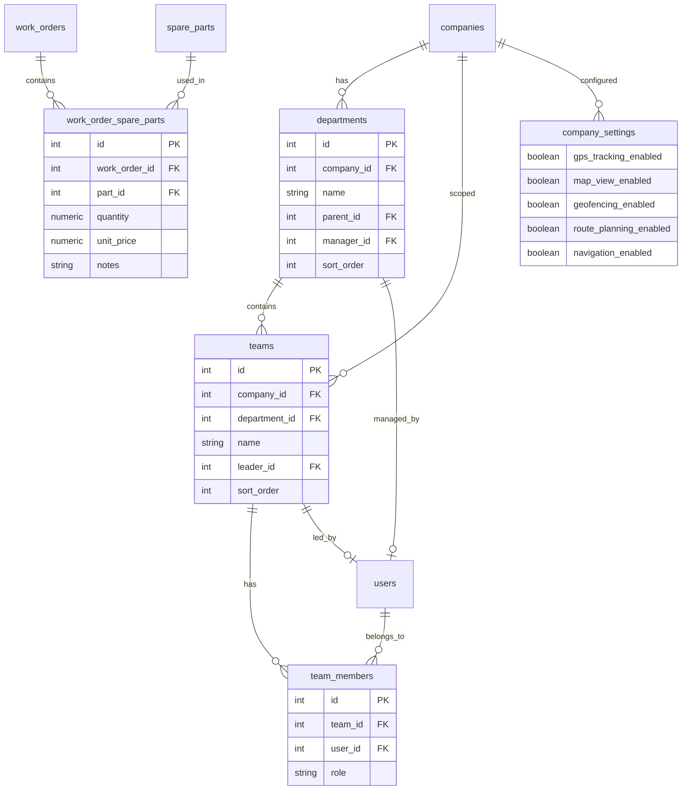

# Plan architektoniczny: typy zleceń, hierarchia organizacyjna, przełącznik GPS

> **Cel:** Przebudowa Werkit w uniwersalny system logistyczny (nie tylko transport kruszyw) z:
> 1. Dwoma rodzajami zleceń: **praca na maszynie** (z materiałami) i **naprawa maszyny** (z częściami)
> 2. Hierarchiczną strukturą organizacyjną pracowników
> 3. GPS/Map jako opcją włączaną przez superadmina per organizacja

---

## Spis treści

1. [Analiza obecnego stanu](#1-analiza-obecnego-stanu)
2. [Rodzaje zleceń — rozróżnienie](#2-rodzaje-zleceń--rozróżnienie)
3. [Hierarchia organizacyjna](#3-hierarchia-organizacyjna)
4. [Przełącznik GPS/Map](#4-przełącznik-gpsmap)
5. [Plan wdrożenia (fazy)](#5-plan-wdrożenia-fazy)
6. [Diagramy](#6-diagramy)

---

## 1. Analiza obecnego stanu

### 1.1. Obecny model zleceń

Obecnie [`work_orders`](src/db/schema.ts:216) ma jeden typ — wszystkie zlecenia mają te same kolumny:
- `materialId` — materiał (opcjonalny, zależny od kategorii)
- `quantityTons` — ilość w tonach
- `resourceId` — maszyna
- `categoryId` — kategoria zlecenia (z [`resource_categories`](src/db/schema.ts:38))

Kategorie zleceń (`resource_categories`) mają flagi `showMaterial`, `showQuantity`, `showCustomer`, `showTaskDescription` itp., które sterują widocznością pól w formularzach. Jest też flaga `isStationary` oznaczająca "warsztat/plac" (bez GPS).

**Problem:** Nie ma rozróżnienia między "zleceniem transportu materiałów" a "zleceniem naprawy maszyny". Części zamienne (`spare_parts`) istnieją jako osobny moduł DUR, ale nie są powiązane z sesją/zleceniem naprawczym.

### 1.2. Obecny model organizacyjny

- [`companies`](src/db/schema.ts:10) — tenant (firma)
- [`users`](src/db/schema.ts:18) — użytkownicy z rolą (`superadmin | admin | worker | viewer`) i `companyId`
- **Brak hierarchii** — wszyscy pracownicy są płasko przypisani do firmy

### 1.3. Obecny model GPS/Map

- [`gps_logs`](src/db/schema.ts:178) — twardo zapisywane dla każdej sesji
- [`companySettings`](src/db/schema.ts:195) — ma `geofenceRadiusMeters`, `baseLatitude`, `baseLongitude`
- Komponenty mapy: [`components/Map/`](src/components/Map/) — Leaflet + OSRM
- GPS worker: [`features/worker/gps/`](src/features/worker/gps/) + hook [`useWorkerGPS`](src/features/worker/hooks/)
- **Brak przełącznika** — GPS jest zawsze włączony

---

## 2. Rodzaje zleceń — rozróżnienie

### 2.1. Dwa typy zleceń

Zamiast tworzyć osobną tabelę, dodajemy kolumnę `order_type` do [`work_orders`](src/db/schema.ts:216):

```typescript
// Nowa kolumna w work_orders
orderType: varchar('order_type', { length: 50 }).notNull().default('machine_work')
// Dozwolone wartości: 'machine_work' | 'machine_repair'
```

| Typ | Opis | Wymagane pola | Opcjonalne pola |
|-----|------|---------------|-----------------|
| `machine_work` | Praca na maszynie (transport, kopanie, załadunek) | `resourceId`, `categoryId` | `materialId`, `quantityTons`, `customerId`, `taskDescription` |
| `machine_repair` | Naprawa maszyny (DUR) | `resourceId`, `categoryId` | `spareParts[]`, `taskDescription`, `customerId` |

### 2.2. Zmiany w schemacie DB

#### `work_orders` — nowe kolumny

```sql
ALTER TABLE work_orders ADD COLUMN order_type VARCHAR(50) NOT NULL DEFAULT 'machine_work';
ALTER TABLE work_orders ADD COLUMN repair_description TEXT;  -- opis usterki (dla napraw)
ALTER TABLE work_orders ADD COLUMN repair_notes TEXT;        -- notatki serwisowe po naprawie
```

#### `work_sessions` — nowe kolumny

```sql
ALTER TABLE work_sessions ADD COLUMN order_type VARCHAR(50) NOT NULL DEFAULT 'machine_work';
ALTER TABLE work_sessions ADD COLUMN repair_description TEXT;
ALTER TABLE work_sessions ADD COLUMN repair_notes TEXT;
```

#### Nowa tabela: `work_order_spare_parts` (łącznik zlecenie naprawcze ↔ części)

```sql
CREATE TABLE work_order_spare_parts (
  id SERIAL PRIMARY KEY,
  work_order_id INTEGER NOT NULL REFERENCES work_orders(id) ON DELETE CASCADE,
  part_id INTEGER NOT NULL REFERENCES spare_parts(id) ON DELETE CASCADE,
  quantity NUMERIC(10,2) NOT NULL DEFAULT 1,
  unit_price NUMERIC(10,2),           -- cena w momencie użycia (snapshot)
  notes TEXT,
  created_at TIMESTAMP NOT NULL DEFAULT NOW()
);
```

#### `resource_categories` — nowa flaga `order_type`

```sql
ALTER TABLE resource_categories ADD COLUMN order_type VARCHAR(50) NOT NULL DEFAULT 'machine_work';
```

To pozwoli określić per-kategoria, czy dany typ zlecenia to "praca na maszynie" czy "naprawa". Kategorie z `order_type = 'machine_repair'` będą:
- Nie pokazywać pola `material` / `quantityTons`
- Pokazywać panel wyboru części zamiennych (kompatybilnych z kategorią maszyny)
- Mieć opis usterki zamiast opisu zadania

### 2.3. Zmiany w typach TypeScript

#### [`src/types/worker.ts`](src/types/worker.ts)

```typescript
export type OrderType = 'machine_work' | 'machine_repair';

export type WorkOrder = {
  // ... istniejące pola +
  orderType: OrderType | null;
  repairDescription?: string | null;
  repairNotes?: string | null;
  spareParts?: WorkOrderSparePart[];
};

export type WorkOrderSparePart = {
  id: number;
  partId: number;
  partName: string;
  catalogNumber: string;
  quantity: number;
  unitPrice?: number | null;
  notes?: string | null;
};

export type Session = {
  // ... istniejące pola +
  orderType: OrderType | null;
  repairDescription?: string | null;
  repairNotes?: string | null;
};
```

#### [`src/types/admin.ts`](src/types/admin.ts)

```typescript
export type BaseCategory = {
  // ... istniejące pola +
  orderType: OrderType;
};
```

### 2.4. Zmiany w serwisach

#### [`src/services/AdminOrderService.ts`](src/services/AdminOrderService.ts)

- Metoda `createOrder` — przyjmuje `orderType`, waliduje wymagane pola w zależności od typu
- Metoda `updateOrder` — analogicznie
- Metoda `getActiveWorkOrders` — zwraca `orderType`

#### [`src/services/WorkerOrderService.ts`](src/services/WorkerOrderService.ts)

- `acceptOrder` — przenosi `orderType` z `work_orders` do `work_sessions`
- `createOwnOrder` — waliduje `orderType`

#### Nowy serwis: `src/services/dur/WorkOrderSparePartService.ts`

```typescript
export class WorkOrderSparePartService {
  static async getPartsForWorkOrder(workOrderId: number, companyId: number): Promise<WorkOrderSparePart[]>;
  static async addPartToWorkOrder(workOrderId: number, partId: number, quantity: number, companyId: number): Promise<void>;
  static async removePartFromWorkOrder(id: number, companyId: number): Promise<void>;
  static async updatePartQuantity(id: number, quantity: number, companyId: number): Promise<void>;
}
```

### 2.5. Zmiany w UI

#### Formularz zlecenia (admin) — [`OrderFormFields.tsx`](src/components/Admin/Modals/OrderFormFields.tsx)

- Po wybraniu kategorii, jeśli `order_type = 'machine_repair'`:
  - Ukryj pole `material` i `quantityTons`
  - Pokaż pole `repairDescription` (opis usterki)
  - Dodaj sekcję "Części zamienne" z wyszukiwarką części kompatybilnych z kategorią maszyny
- Jeśli `order_type = 'machine_work'`:
  - Obecne zachowanie (materiał, tony, klient)

#### Wizard pracownika — [`WizardClient.tsx`](src/features/worker/components/wizard/WizardClient.tsx)

- Krok 3 (szczegóły) — rozgałęzienie w zależności od `orderType` wybranej kategorii
- Dla `machine_repair`: pole opisu usterki + wybór części z magazynu

#### Dashboard sesji — [`ActiveSessionDashboard`](src/features/worker/components/shell/)

- Dla sesji `machine_repair`: pokaż użyte części, możliwość dodania notatki serwisowej

### 2.6. Migracja DB

Nowa migracja: `drizzle/0021_order_types.sql`

```sql
-- 1. Kolumna order_type w resource_categories
ALTER TABLE resource_categories ADD COLUMN IF NOT EXISTS order_type VARCHAR(50) NOT NULL DEFAULT 'machine_work';

-- 2. Kolumny w work_orders
ALTER TABLE work_orders ADD COLUMN IF NOT EXISTS order_type VARCHAR(50) NOT NULL DEFAULT 'machine_work';
ALTER TABLE work_orders ADD COLUMN IF NOT EXISTS repair_description TEXT;
ALTER TABLE work_orders ADD COLUMN IF NOT EXISTS repair_notes TEXT;

-- 3. Kolumny w work_sessions
ALTER TABLE work_sessions ADD COLUMN IF NOT EXISTS order_type VARCHAR(50) NOT NULL DEFAULT 'machine_work';
ALTER TABLE work_sessions ADD COLUMN IF NOT EXISTS repair_description TEXT;
ALTER TABLE work_sessions ADD COLUMN IF NOT EXISTS repair_notes TEXT;

-- 4. Tabela łącznikowa zlecenie ↔ części
CREATE TABLE IF NOT EXISTS work_order_spare_parts (
  id SERIAL PRIMARY KEY,
  work_order_id INTEGER NOT NULL REFERENCES work_orders(id) ON DELETE CASCADE,
  part_id INTEGER NOT NULL REFERENCES spare_parts(id) ON DELETE CASCADE,
  quantity NUMERIC(10,2) NOT NULL DEFAULT 1,
  unit_price NUMERIC(10,2),
  notes TEXT,
  created_at TIMESTAMP NOT NULL DEFAULT NOW()
);

-- 5. Indeksy
CREATE INDEX IF NOT EXISTS idx_work_order_spare_parts_order ON work_order_spare_parts(work_order_id);
CREATE INDEX IF NOT EXISTS idx_work_order_spare_parts_part ON work_order_spare_parts(part_id);
```

---

## 3. Hierarchia organizacyjna

### 3.1. Model danych

Obecnie: `Company → Users` (płasko). Nowy model:

```
Company
  ├── Department (dział/oddział)
  │     ├── Team (zespół)
  │     │     ├── Worker
  │     │     └── Worker
  │     └── Team
  └── Department
```

#### Nowe tabele

```sql
-- Działy / oddziały
CREATE TABLE departments (
  id SERIAL PRIMARY KEY,
  company_id INTEGER NOT NULL REFERENCES companies(id) ON DELETE CASCADE,
  name VARCHAR(255) NOT NULL,
  parent_id INTEGER REFERENCES departments(id) ON DELETE SET NULL,  -- hierarchia działów
  manager_id INTEGER REFERENCES users(id) ON DELETE SET NULL,       -- kierownik działu
  sort_order INTEGER NOT NULL DEFAULT 0,
  is_active BOOLEAN NOT NULL DEFAULT true,
  created_at TIMESTAMP NOT NULL DEFAULT NOW()
);

-- Zespoły (pod-działy)
CREATE TABLE teams (
  id SERIAL PRIMARY KEY,
  company_id INTEGER NOT NULL REFERENCES companies(id) ON DELETE CASCADE,
  department_id INTEGER NOT NULL REFERENCES departments(id) ON DELETE CASCADE,
  name VARCHAR(255) NOT NULL,
  leader_id INTEGER REFERENCES users(id) ON DELETE SET NULL,        -- lider zespołu
  sort_order INTEGER NOT NULL DEFAULT 0,
  is_active BOOLEAN NOT NULL DEFAULT true,
  created_at TIMESTAMP NOT NULL DEFAULT NOW()
);

-- Przypisanie pracownika do zespołu (N:N — pracownik może być w wielu zespołach)
CREATE TABLE team_members (
  id SERIAL PRIMARY KEY,
  team_id INTEGER NOT NULL REFERENCES teams(id) ON DELETE CASCADE,
  user_id INTEGER NOT NULL REFERENCES users(id) ON DELETE CASCADE,
  role VARCHAR(50) NOT NULL DEFAULT 'member',  -- 'leader' | 'member'
  joined_at TIMESTAMP NOT NULL DEFAULT NOW(),
  UNIQUE (team_id, user_id)
);
```

### 3.2. TypeScript types

Nowy plik: [`src/types/organization.ts`](src/types/organization.ts)

```typescript
export type Department = {
  id: number;
  companyId: number;
  name: string;
  parentId: number | null;
  managerId: number | null;
  managerName?: string | null;
  sortOrder: number;
  isActive: boolean;
  children?: Department[];
  teams?: Team[];
};

export type Team = {
  id: number;
  companyId: number;
  departmentId: number;
  name: string;
  leaderId: number | null;
  leaderName?: string | null;
  sortOrder: number;
  isActive: boolean;
  members?: TeamMember[];
};

export type TeamMember = {
  id: number;
  teamId: number;
  userId: number;
  userName: string;
  role: 'leader' | 'member';
  joinedAt: string;
};
```

### 3.3. Serwisy

Nowy serwis: [`src/services/OrganizationService.ts`](src/services/OrganizationService.ts)

```typescript
export class OrganizationService {
  // Działy
  static async getDepartmentsTree(companyId: number): Promise<Department[]>;
  static async createDepartment(companyId: number, data: CreateDepartmentInput): Promise<Department>;
  static async updateDepartment(id: number, companyId: number, data: UpdateDepartmentInput): Promise<void>;
  static async deleteDepartment(id: number, companyId: number): Promise<void>;

  // Zespoły
  static async getTeamsByDepartment(departmentId: number, companyId: number): Promise<Team[]>;
  static async createTeam(companyId: number, data: CreateTeamInput): Promise<Team>;
  static async updateTeam(id: number, companyId: number, data: UpdateTeamInput): Promise<void>;
  static async deleteTeam(id: number, companyId: number): Promise<void>;

  // Członkowie
  static async getTeamMembers(teamId: number, companyId: number): Promise<TeamMember[]>;
  static async addMember(teamId: number, userId: number, companyId: number): Promise<void>;
  static async removeMember(teamId: number, userId: number, companyId: number): Promise<void>;
  static async setMemberRole(teamId: number, userId: number, role: 'leader' | 'member', companyId: number): Promise<void>;
}
```

### 3.4. API endpoints

| Endpoint | Metoda | Opis |
|----------|--------|------|
| `/api/admin/organization/departments` | GET | Drzewo działów |
| `/api/admin/organization/departments` | POST | Utwórz dział |
| `/api/admin/organization/departments/[id]` | PUT | Edytuj dział |
| `/api/admin/organization/departments/[id]` | DELETE | Usuń dział |
| `/api/admin/organization/teams` | GET | Lista zespołów (opcjonalnie `?departmentId=`) |
| `/api/admin/organization/teams` | POST | Utwórz zespół |
| `/api/admin/organization/teams/[id]` | PUT | Edytuj zespół |
| `/api/admin/organization/teams/[id]` | DELETE | Usuń zespół |
| `/api/admin/organization/teams/[id]/members` | GET | Członkowie zespołu |
| `/api/admin/organization/teams/[id]/members` | POST | Dodaj członka |
| `/api/admin/organization/teams/[id]/members/[userId]` | DELETE | Usuń członka |
| `/api/admin/organization/teams/[id]/members/[userId]/role` | PUT | Zmień rolę |

### 3.5. UI — panel admina

Nowa zakładka w sidebarze admina: **"Organizacja"** (`/admin/organization`)

- **Drzewo organizacyjne** — widok działów i zespołów (hierarchiczny, rozwijany)
- **Zarządzanie działami** — CRUD z wyborem kierownika
- **Zarządzanie zespołami** — CRUD z wyborem lidera i przypisaniem członków
- **Przegląd pracowników** — lista z filtrowaniem po dziale/zespole

### 3.6. Wpływ na istniejące funkcje

- **Przypisanie zlecenia** — admin wybiera pracownika, ale widzi też jego dział/zespół
- **Raporty** — możliwość filtrowania po dziale/zespole
- **Logi** — kontekst organizacyjny w logach

---

## 4. Przełącznik GPS/Map

### 4.1. Model danych

Nowe kolumny w [`company_settings`](src/db/schema.ts:195):

```sql
ALTER TABLE company_settings ADD COLUMN IF NOT EXISTS gps_tracking_enabled BOOLEAN NOT NULL DEFAULT true;
ALTER TABLE company_settings ADD COLUMN IF NOT EXISTS map_view_enabled BOOLEAN NOT NULL DEFAULT true;
ALTER TABLE company_settings ADD COLUMN IF NOT EXISTS geofencing_enabled BOOLEAN NOT NULL DEFAULT true;
ALTER TABLE company_settings ADD COLUMN IF NOT EXISTS route_planning_enabled BOOLEAN NOT NULL DEFAULT true;
ALTER TABLE company_settings ADD COLUMN IF NOT EXISTS navigation_enabled BOOLEAN NOT NULL DEFAULT true;
```

### 4.2. Flagi funkcji

| Flaga | Co kontroluje | Gdy `false` |
|-------|---------------|-------------|
| `gps_tracking_enabled` | Zapis `gps_logs` podczas sesji | Worker nie wysyła GPS; endpoint `/api/worker/gps` zwraca 204; brak śladu na mapie |
| `map_view_enabled` | Widok mapy w adminie i workerze | Ukryj wszystkie komponenty mapy (Leaflet, OSRM) |
| `geofencing_enabled` | Geofence radius, alerty dotarcia | Nie sprawdzaj odległości; nie blokuj zakończenia sesji |
| `route_planning_enabled` | Planowanie trasy, waypointy | Ukryj `canEditRoute`; nie pokazuj przycisku "zaplanuj trasę" |
| `navigation_enabled` | Turn-by-turn OSRM | Ukryj nawigację krok po kroku |

### 4.3. Feature flag provider

Nowy komponent/provider: [`src/components/FeatureFlags.tsx`](src/components/FeatureFlags.tsx)

```typescript
export type FeatureFlags = {
  gpsTracking: boolean;
  mapView: boolean;
  geofencing: boolean;
  routePlanning: boolean;
  navigation: boolean;
};

// Provider React + hook
export function useFeatureFlags(): FeatureFlags;
export function FeatureFlagsProvider({ children, flags }: { children: React.ReactNode; flags: FeatureFlags }) {
  // ...
}
```

### 4.4. Ładowanie flag

W layoutach admina i workera, po pobraniu `companySettings`, mapujemy na `FeatureFlags`:

```typescript
// W admin/layout.tsx i worker/layout.tsx
const settings = await SettingsService.getSettings(companyId);
const featureFlags: FeatureFlags = {
  gpsTracking: settings[0]?.gpsTrackingEnabled ?? true,
  mapView: settings[0]?.mapViewEnabled ?? true,
  geofencing: settings[0]?.geofencingEnabled ?? true,
  routePlanning: settings[0]?.routePlanningEnabled ?? true,
  navigation: settings[0]?.navigationEnabled ?? true,
};
```

### 4.5. Gdzie wstawić guardy

#### Backend (serwisy)

| Serwis | Guard |
|--------|-------|
| [`GpsService`](src/services/GpsService.ts) | `saveGpsLogs` — sprawdź `gpsTrackingEnabled`; jeśli `false`, return 204 |
| [`WorkerSessionService`](src/services/WorkerSessionService.ts) | `endActiveSession` — jeśli `geofencingEnabled === false`, nie wymagaj geofence |
| [`CustomerLocationService`](src/services/CustomerLocationService.ts) | `setRouteWaypoints` — sprawdź `routePlanningEnabled` |
| [`AdminOrderService`](src/services/AdminOrderService.ts) | Przy tworzeniu zlecenia — jeśli `routePlanningEnabled === false`, ukryj pole trasy |

#### Frontend (komponenty)

| Komponent | Guard |
|-----------|-------|
| [`components/Map/`](src/components/Map/) — wszystkie | `if (!mapViewEnabled) return null` |
| [`features/worker/gps/`](src/features/worker/gps/) — GPSManager | `if (!gpsTrackingEnabled) nie startuj watchPosition` |
| [`features/worker/hooks/useWorkerGPS.ts`](src/features/worker/hooks/) | `if (!gpsTrackingEnabled) return { isTracking: false }` |
| [`components/work-orders/WorkOrderScheduleFields.tsx`](src/components/work-orders/) | Ukryj pole trasy jeśli `!routePlanningEnabled` |
| [`components/Admin/Modals/SessionMapSection.tsx`](src/components/Admin/Modals/) | Ukryj jeśli `!mapViewEnabled` |
| [`components/Admin/Orders/OrdersDispatchTable.tsx`](src/components/Admin/Orders/) | Ukryj kolumnę mapy jeśli `!mapViewEnabled` |
| [`app/worker/history/[id]/MapWrapper.tsx`](src/app/worker/history/[id]/MapWrapper.tsx) | Ukryj jeśli `!mapViewEnabled` |

### 4.6. UI ustawień — panel superadmina

W [`PlatformCompanyForm.tsx`](src/components/Platform/PlatformCompanyForm.tsx) — sekcja "Funkcjonalności":

```
┌─ Funkcjonalności ─────────────────────────────────┐
│                                                    │
│  [✓] Śledzenie GPS (gps_tracking_enabled)          │
│  [✓] Podgląd mapy (map_view_enabled)               │
│  [✓] Geofencing (geofencing_enabled)               │
│  [✓] Planowanie trasy (route_planning_enabled)     │
│  [✓] Nawigacja krok po kroku (navigation_enabled)  │
│                                                    │
│  Uwaga: wyłączenie GPS wyłącza też mapę,            │
│  geofencing i nawigację.                            │
└────────────────────────────────────────────────────┘
```

### 4.7. Zależności między flagami

```
gps_tracking_enabled = false
  → map_view_enabled = false (wymuszony)
  → geofencing_enabled = false (wymuszony)
  → navigation_enabled = false (wymuszony)
  → route_planning_enabled = false (wymuszony)

map_view_enabled = false
  → navigation_enabled = false (wymuszony)
```

Te zależności są egzekwowane po stronie UI (przy zapisie ustawień) i backendu (przy odczycie).

---

## 5. Plan wdrożenia (fazy)

### Faza 1: Typy zleceń (order_type)

| # | Zadanie | Pliki |
|---|---------|-------|
| 1.1 | Migracja DB: `order_type` w `resource_categories`, `work_orders`, `work_sessions` + tabela `work_order_spare_parts` | `drizzle/0021_order_types.sql`, `src/db/schema.ts` |
| 1.2 | Aktualizacja typów TS: `OrderType`, rozszerzenie `WorkOrder`, `Session`, `BaseCategory` | `src/types/worker.ts`, `src/types/admin.ts` |
| 1.3 | Serwis `WorkOrderSparePartService` | `src/services/dur/WorkOrderSparePartService.ts` |
| 1.4 | Rozszerzenie `AdminOrderService.createOrder` o walidację `orderType` | `src/services/AdminOrderService.ts` |
| 1.5 | Rozszerzenie `WorkerOrderService.acceptOrder` o przenoszenie `orderType` | `src/services/WorkerOrderService.ts` |
| 1.6 | UI admin: formularz zlecenia rozgałęziony na `machine_work` / `machine_repair` | `src/components/Admin/Modals/OrderFormFields.tsx` |
| 1.7 | UI worker: wizard z wyborem części dla napraw | `src/features/worker/components/wizard/` |
| 1.8 | UI worker: dashboard sesji naprawczej (lista części, notatki serwisowe) | `src/features/worker/components/shell/` |
| 1.9 | i18n: nowe klucze dla typów zleceń | `src/i18n/locales/pl.ts`, `en.ts`, `de.ts` |
| 1.10 | API: CRUD `work_order_spare_parts` | `src/app/api/dur/work-orders/[id]/parts/route.ts` |

### Faza 2: Hierarchia organizacyjna

| # | Zadanie | Pliki |
|---|---------|-------|
| 2.1 | Migracja DB: tabele `departments`, `teams`, `team_members` | `drizzle/0022_organization.sql`, `src/db/schema.ts` |
| 2.2 | Typy TS: `Department`, `Team`, `TeamMember` | `src/types/organization.ts` |
| 2.3 | Serwis `OrganizationService` | `src/services/OrganizationService.ts` |
| 2.4 | API: CRUD departamentów, zespołów, członków | `src/app/api/admin/organization/` |
| 2.5 | UI admin: strona `/admin/organization` z drzewem | `src/features/admin/organization/` |
| 2.6 | Rozszerzenie `AdminUserService` o kontekst organizacyjny | `src/services/AdminUserService.ts` |
| 2.7 | Rozszerzenie raportów o filtrowanie po dziale/zespole | `src/services/AdminReportService.ts` |
| 2.8 | i18n: nowe klucze dla organizacji | `src/i18n/locales/` |

### Faza 3: Przełącznik GPS/Map

| # | Zadanie | Pliki |
|---|---------|-------|
| 3.1 | Migracja DB: flagi w `company_settings` | `drizzle/0023_feature_flags.sql`, `src/db/schema.ts` |
| 3.2 | Typy TS: `FeatureFlags` | `src/types/featureFlags.ts` |
| 3.3 | Provider `FeatureFlagsProvider` + hook `useFeatureFlags` | `src/components/FeatureFlags.tsx` |
| 3.4 | Ładowanie flag w layoutach admina i workera | `src/app/admin/layout.tsx`, `src/app/worker/layout.tsx` |
| 3.5 | Guardy w serwisach backendu (GPS, geofencing, route) | `src/services/GpsService.ts`, `WorkerSessionService.ts`, `CustomerLocationService.ts` |
| 3.6 | Guardy w komponentach frontendu (mapa, GPS worker, nawigacja) | `src/components/Map/`, `src/features/worker/gps/`, `src/features/worker/hooks/` |
| 3.7 | UI superadmina: przełączniki w formularzu firmy | `src/components/Platform/PlatformCompanyForm.tsx` |
| 3.8 | i18n: nowe klucze dla ustawień funkcji | `src/i18n/locales/` |

---

## 6. Diagramy

### 6.1. Diagram przepływu — tworzenie zlecenia (admin)



### 6.2. Diagram przepływu — akceptacja zlecenia (worker)



### 6.3. Diagram — hierarchia organizacyjna



### 6.4. Diagram — zależności flag GPS



### 6.5. Diagram ER — nowe encje



---

## 7. Podsumowanie — todo list dla implementacji

### Krok 1: Typy zleceń
- [ ] Migracja `0021_order_types.sql` + aktualizacja `schema.ts`
- [ ] Typy TS: `OrderType`, rozszerzenia
- [ ] `WorkOrderSparePartService`
- [ ] Rozszerzenie `AdminOrderService`, `WorkerOrderService`
- [ ] UI admin: rozgałęziony formularz
- [ ] UI worker: wizard + dashboard dla napraw
- [ ] API: CRUD części w zleceniu
- [ ] i18n: nowe klucze

### Krok 2: Hierarchia organizacyjna
- [ ] Migracja `0022_organization.sql` + aktualizacja `schema.ts`
- [ ] Typy TS: `Department`, `Team`, `TeamMember`
- [ ] `OrganizationService`
- [ ] API: CRUD organizacji
- [ ] UI admin: strona `/admin/organization`
- [ ] Rozszerzenie raportów o filtr organizacyjny
- [ ] i18n: nowe kl